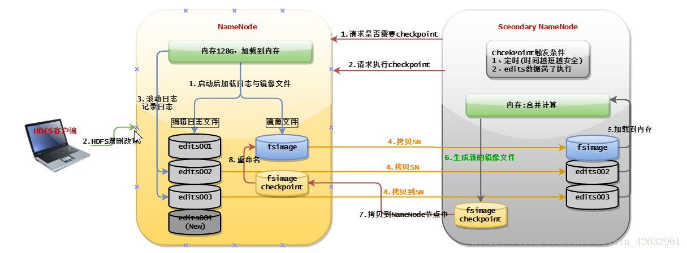
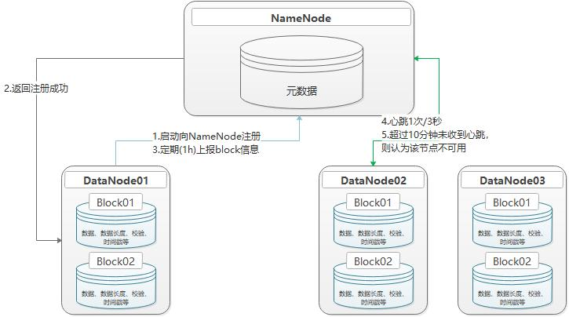
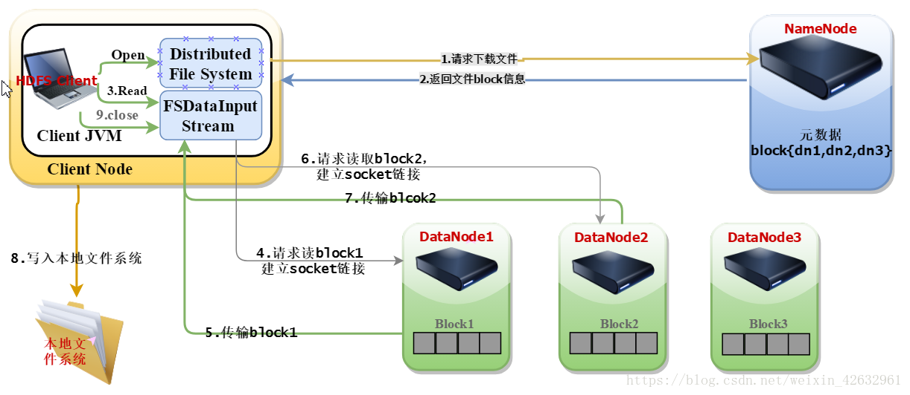
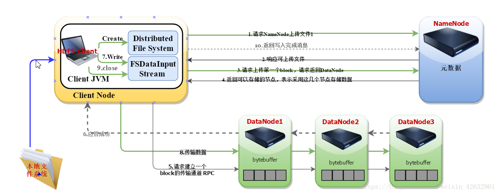

### 什么是大数据?
+ 定义：大数据是指无法再一定时间内用常规的软件工具对齐内容进行抓取、管理和处理的数据集合。大数据技术，是指
从各种各样的类型的数据中，快速获得由价值信息的能力。适用于大数据的技术，包括大规模并行处理(MPP)数据库，数据
挖掘，分布式系统，分布式数据库，云计算平台，互联网，和可扩展的存储系统
+ 市场需求：传统的数据处理技术无法胜任，需要催生新的技术。一套用来处理海量数据的软件工具应运而生，这就是大数据。
+ 技术层面：数据处理技术
+ 处理方式：大数据并行化处理数据
+ 处理海量技术的核心技术：分布式
> + 海量的数据存储:分布式
> + 海量的数据计算：分布式
+ ★★★★★ 存储和计算成熟的框架
> + 数据存储：
> > + ★HDFS：分布式文件系统(Hadoop的存储框架)，后续的HIVE HBASE底层存储数据都是HDFS
> > + ★Hbase：分布式数据库系统(HDFS的二次封装)
> > + ★KAFKA：分布式消息缓存系统
> + 计算框架:
> > + ★MapReduce：离线计算框架(Hadoop的计算框架，主要学习核心事项，后续的Flink Spark都会用到该思想)
> > + ★Spark：离线批处理、在线流式计算、机器学习等计算框架
> > + Storm：实时流式计算框架
> > + ★Flink：实时流式计算框架
> + 辅助工具：
> > + ★HIVE：数据仓库工具，可以直接使用SQL
> > + ★Flume：数据采集工具
> > + ★Sqoop：数据迁移工具(传统数据库到分布式，分布式到传统数据库)
> > + ★Zookeeper：分布式协调工具
> > + ★Azkaban：分布式任务调度工具
### 大数据运用场景
+ 公司运营情况
+ 电商推荐系统：如淘宝、京东、苏宁，大量基于算法模型的运行，的出来各种推荐结论
+ 广告推荐系统：基于海量互联网用户的各类数据
### 什么是Hadoop
+ 官网：https://hadoop.apache.org/
+ 简介：Apache™Hadoop®项目开发了用于`可靠，可扩展的分布式计算`的开源软件。Apache Hadoop软件库是一个框架，
允许使用简单的`编程模型跨计算机集群分布式处理大型数据集`。它旨在从单个服务器`扩展到数千台计算机`，每台计算机都提供本地计算和存储。库本身不是依靠硬件来提供高可用性，而是设计用于检测和处理应用程序层的故障，从而在计算机集群之上提供高可用性服务，每个计算机都可能容易出现故障。
+ 特点：用户可以在不了解分布式底层细节而开发分布式程序
+ 核心组件：
> + 分布式文件系统:HDFS 实现存储在多台服务器上
> + 分布式运算编程框架:MapReduce 实现多台机器的分布式并计算
> + 分布式资源调度平台：Yarn 调度大量的MapReduce程序，并且合理的分配运算数据
### HDFS的运行机制
- 用户文件会被切块后存储在多台DataNode服务器当中，并且每个文件在整个集群中存放多个副本，可以提高数据的安全性
> - 对用户提供统一的目录，存储时会把文件切分为若干个块存储在不同DataNode中
> - 用户可以设置多个数据副本，以增强数据的安全性
> - 用户存储的信息放在NameNode中
### NameNode简介
- NameNode：整个文件系统的管理节点，接收用户的请求，保存这文件/目录的元数据信息和每个文件对应的block映射表。
> - fsimage：元数据镜像文件，存储一段时间内NameNode的元数据信息
> - edits：保存操作日志文件
> - fstime：保存最近一次checkpoint的时间
> - seen_txid：最后一个edites的数字
> - VERSION
> > - namespaceID=1001264370 NameNode ID
> > - clusterID=CID-8364236c-e305-4962-bf55-aff5d860710e    唯一的集群ID，不同集群有不同ID
> > - cTime=1539181056245   NameNode的创建时间，刚格式化为0，升级后也为0
> > - storageType=NAME_NODE  节点类型
> > - blockpoolID=BP-793106303-192.168.244.129-1539181056245     表示的一个组的ID，跨集群的唯一
> > - layoutVersion=-63  不同版本不一样，更新版本后不一样

### NameNode节点工作机制

> - 对未在镜像文件中的日志和镜像文件进行合并且备份
> 1. NameNode节点每隔一定时间请求secondaryNameNode合并操作
> 2. secondaryNameNode请求NameNode进行edits.log的滚动，这样新的编辑操作就能够进入新的文件中
> 3. secondaryNameNode从NameNode中下载fsimage和edits.log
> 4. secondaryNamenode进行fsImage和edits.log的合并,成为fsImage.checkpoint文件
> 5. namenode下载合并后的fsImage.checkpoin文件
> 5. 将fsImage.checkpoint和edits.new命名为原来的文件名(这样之后fsImage和内存中的元数据只差edits.new)
> 5. checkpoint设置在dfs.namenode.checkpoint字段进行设置，dfs.namenode.checkpoint.chek.period，dfs.namenode.checkpoint.txns进行设置
### NataNode简介
提供正式文件的数据存储服务，它文件中的多个块(block)，block是最基础的存储单元，HDFS默认的块大小是128M
### DataNode节点工作机制

1. 一个数据块在DataNode上以文件形式存储在磁盘上，包括两个文件，一个数据本身，一个是元数据包括数据块的长度、块写数据的校验
和，以及时间戳
1. DataNode启动后向NameNode注册，通过后，周期性(例如1h)的向NameNode上报所有的块信息
1. 心跳是每3秒一次，心跳返回结果带有NameNode给该DataNode的命令，如复制块数据到另外一个机器，如果超过10分钟没有收到某个
DataNode的心跳，则任务该节点不可用
1. 集群运行中可以安全的加入和退出一些机器

### HDFS读流程

1. 和NameNode 通信查询元数据(block所在的DataNode节点)，找到文件块所在的DataNode服务器
2. 选择一条DataNode(就近原则，然后随机)服务器，请求建立socket流
3. DataNode开始发送数据(从磁盘里面读取数据放入流，以packet为单位进行校验)
4. 客户端以packet为单位接收，先在本地缓冲，然后写入目标文件，后面的Block块就相当于是append到前面的block块，最后合并成
最终需要的文件

### HDFS写流程

1. 对NameNode通信请求上传文件，NameNode检查目标文件是否已存在，父目录是否存在，创建者是否有权限进行操作，成功则会为
文件创建一个记录.
2. NameNode返回是否可以上传.
3. Client会先对文件进行切分，比如一个Block块128M，文件有300M会被切分为3个块，两个128M，一个44M，请求第一个Block该传输
到哪些DataNode服务器上.
4. NameNode返回可以存储的DataNode节点信息.
5. Client请求一台DataNode上传数据（本质上是一个RPC调用，建立pipeline），第一个DataNode收到请求会继续调用第二个DataNod，
然后第二个调用第三个DataNode，将整个pipeline建立完成，逐级返回客户端.
6. Client开始往A上传第一个block（先从磁盘读取数据放到一个本地内存缓存），以packet为单位（一个packet为64kb），当然在写入
的时候DataNode会进行数据校验，它并不是通过一个packet进行一次校验,而是以chunk为单位进行校验（512byte），第一台DataNode收到
一个packet就会传给第二台，第二台传给第三台；第一台每传一个packet会放入一个应答队列等待应答.
7. 当一个block传输完成之后，Client再次请求NameNode上传第二个block的服务器，循环3-6步.
8. 所有块写完后调用关闭FSDataInputStream，并返回信息给NameData.
