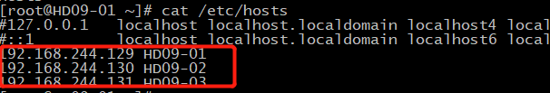
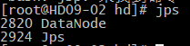
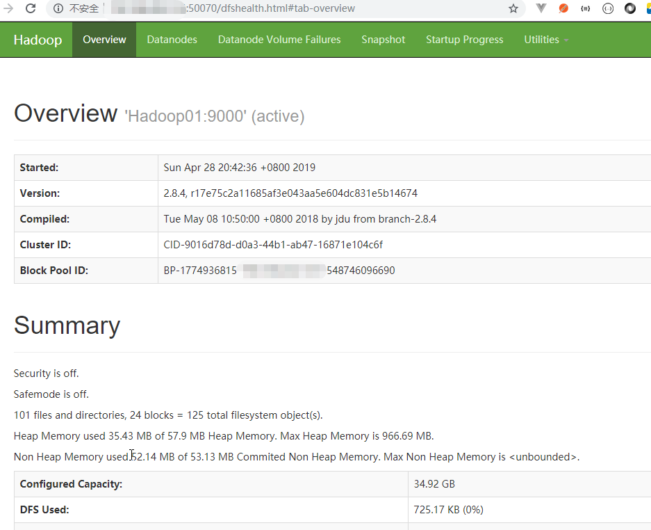

### 准备工作
+ 注：使用连接工具为SecureCRT
+ 准备三个已经装好Linux(以centOS为例)的虚拟机
+ 关闭防火墙 
> + firewall -cmd --state 查看防火墙状态，如果时候no runing表示已经关闭
> + systemctl stop firewalld 关闭防火墙
> + systemctl disable firewalld 禁止防火墙开机启动
+ 修改主机名(永久) vi /etc/hostname 需要重启生效
+ 配置映射文件：vi /etc/hosts 主机IP 和主机名的对应关系

+ 配置好一台映射文件，并复制到其他节点: scp -r /etc/hosts 主机IP:/etc/
+ 安装JDK
> + ALT+P 打开sftp上传压缩包
> + tar -zxvf 压缩包 -C 目标目录(如tar -zxvf jdk-8u144-linux-x64.tar.gz -C hd/)
> + 配置环境变量：
> > + vi/etc/profile 后面追加两行  
> > + export JAVA_HOME=/root/hd/jdk1.8.0_144    # jdk安装目录
> > + export PATH=$PATH:$JAVA_HOME/bin    # 使用bin目录下命令
> > + 复制到其他节点  scp -r /etc/profile 目标IP:/etc/
> > + 加载环境变量 source /etc/profile
+ 免密登录
> + ssh-keygen 生成密钥对
> + ssh-copy-id 本节点名 (先执行本节点名，后执行其他节点名)
### 安装Hadoop集群(版本2.8.5)
+ 下载：http://mirror.bit.edu.cn/apache/hadoop/common/
+ 上传到任意一个集群，并解压到指定目录(tar -zxvf hadoop-2.8.5.tar.gz -D hd/)
+ 修改配置文件
> + vi /root/hd/hadoop-2.8.5/etc/hadoop/hadoop-env.sh 配置JDK路径 如 export JAVA_HOME=/root/hd/jdk1.8.0_144
> + vi /root/hd/hadoop-2.8.5/etc/hadoop/core-site.xml 配置HDFS主节点
```
<configuration>
    <!--配置HDFS-->
    <property>
    <name>fs.defaultFS</name>
    <value>hdfs://HD09-01:9000</value>
    </property>
<configuration>
```
> + vi /root/hd/hadoop-2.8.5/etc/hadoop/hdfs-site.xml 配置元数据和数据存储位置
```
<configuration>
   <!--配置元数据存储位置-->
   <property>
        <name>dfs.namenode.name.dir</name>
         <!-- 元数据存储路径 -->
         <value>/root/hd/dfs/name</value> 
   </property>
    <!--配置数据存储位置-->
   <property>
        <name>dfs.datanode.data.dir</name>
        <!-- 数据存储的路径-->
        <value>/root/hd/dfs/data</value> 
    </property>
</configuration>
```
> + vi /etc/profile 配置Hadoop环境变量
```
export HADOOP_HOME=/root/hd/hadoop-2.8.5
export PATH=$PATH:$JAVA_HOME/bin:$HADOOP_HOME/bin:$HADOOP_HOME/sbin
```
+ 格式化NameNode：hadoop namenode -format
+ 拷贝到其他节点：scp -r hd/hadoop-2.8.5/ HD09-02:/root/hd/
+ 拷贝环境变量到其他节点：scp -r /etc/profile HD09-02:/etc 并都加载环境变量 source /etc/profile
+ 启动NameNode：hadoop-daemon.sh start namenode
> - jps可以查看当前启动进程，如图

+ 启动DataNode：hadoop-daemon.sh start datanode
+ 检查是否启动成功：方位web页面 主节点ip:50070

> - 无法启动datanode情况，看日志报datanode.DataNode (BPOfferService.java:getBlockPoolId(143)) - Block pool ID needed, but service not yet registered with NN
    可以 mv /diska/hadoop/hdfs/data/current  /diska/hadoop/hdfs/data/current.bak可以解决
+ 优化点:配置一键启动脚本
> - 修改配置文件 vi /root/hd/hadoop-2.8.5/etc/hadoop/slaves   加上另外两个节点名称，配置好后，
可以全局使用 start-dfs.sh stop-dfs.sh启动和停止NameNode和DataNode
+ 修改namenode节点副本存放节点：vi /root/hd/hadoop-2.8.5/ejpstc/hadoop/hdfs-site.xml
```
<property>
    <name>dfs.namenode.secondary.http-address</name>
    <value>HD09-02:50090</value>
</property>
```
> - 注：所有节点都需要修改，不然本节点还会有备份
> - 拷贝小技巧：scp -r 文件名 目标主机名:$PWD  相同的路径可以直接使用$PWD代替
+ 扩展：[其他常用配置参数参考](https://www.cnblogs.com/yinghun/p/6230436.html)
