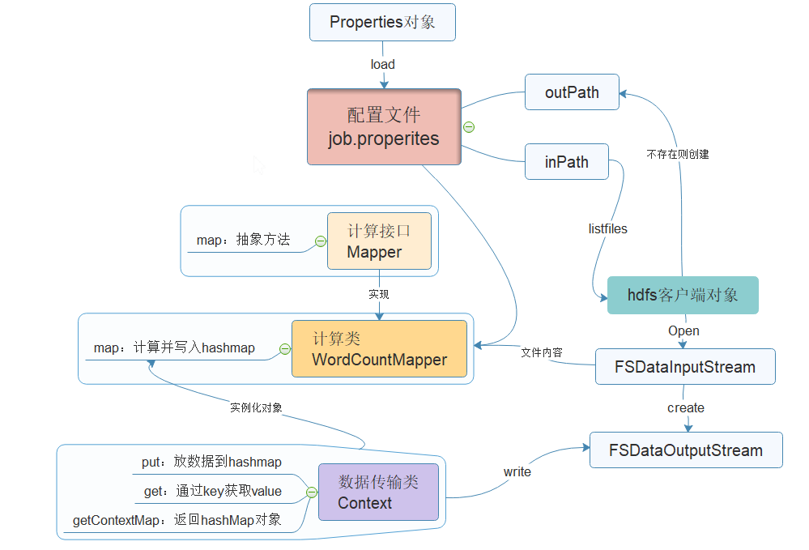

### 手写RPC程序
- 目的：Hadoop读写过程中各节点通信都是使用RPC协议，该程序为了更好的理解Hadoop的通信过程
- [源代码](Demo/src/main/java/RPC)
- 运行流程
> - [启动RPC服务](Demo/src/main/java/RPC/PublishServer.java)
> > 1. 构建RPC框架
> > 1. 绑定地址
> > 1. 绑定端口号
> > 1. 绑定协议，协议为自定义的接口
> > 1. 调用协议的实现类
> > 1. 创建服务
> - [访问RPC服务](Demo/src/main/java/RPC/GetServer.java)
> > 1. 拿到RPC协议
> > 1. 发送请求
> > 1. 打印
### WordCount案例(自己编写的Mapper类，未使用Hadoop的Mapper类)
- 说明：按照MapperReduce思路和已学API实现功能，未使用Hadoop自带的Mapper类，用于理解思路
- 思路：原始文件中存放的为空格隔开的一个一个的单词
> 1. 读取HDFS指定目录中的文件，并按照行进行读取
> 1. 每行进行空格切分
> 1. 相同的单词进行计算，用HashMap进程存储
> 1. 最后存储在HDFS指定路径
- [源代码](Demo/src/main/java/WordCount)
### WordCount运行流程图

