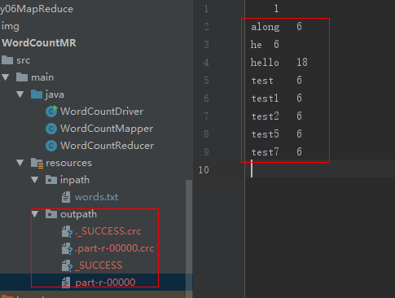
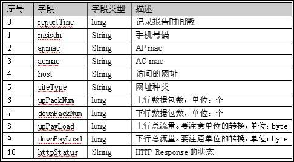

### MapReduce核心编程思想
+ MapReduce运行流程

+ MapReduce编程规范
> + 1、Mapper阶段
> > + 用户自定义Mapper类，需要继承父类Mapper
> > + Mapper的map方法重写(加上对应的业务逻辑)
> > + Mapper的输入数据key，value类型(key，value可以自定义)
> > + map()方法(maptask进程)对每个<key，value>调用一次
> + 2、Reducer阶段(会把相同的key放到一个ReduceTask进行处理)
> > + 用户自定义reducer类，继承父类Reducer 
> > + Reduce的数据输入类型对应的Mapper阶段的输出类型，也是<key,value>
> > + Reduce的reduce方法重写(加上业务逻辑)
> > + ReduceTask的进程对每组的<key,value>调用一次reduce方法
> + 3、 Driver阶段(MR程序需要一个Driver来进行任务的提交，提交的任务是一个描述了各种信息的job对象)
> > + 获取job信息，实例化job和Configuration对象
> > + 设置执行的驱动类
> > + 设置自定义的mapper和reduce类
> > + 设置map的输出入输出类型
> > + 设置reduce的输入和输出类型
> > + 设置输入和输出路径
> > + 提交任务
### MapReduce案例(WordCount案例)
1. [WordCountMapper](MapReduce/src/main/java/WordCount/WordCountMapper.java)
2. [WordCountReducer](MapReduce/src/main/java/WordCount/WordCountReducer.java)
3. [WordCountDriver](MapReduce/src/main/java/WordCount/WordCountDriver.java)
+ 测试结果(项目导入包后可以直接运行)<br/>
### MapReduce集群模式运行
+ 修改配置文件
> + 修改配置文件名称：mv mapred-sit.xml.template mapred-site.xml
> + 增加以下配置，使用yarn来提交任务
```
<property>
    <name>mapreduce.framework.name</name>
    <value>yarn</value>
</property>
```
> + 修改代码的输入和输出路径为HDFS的，如下
```
FileInputFormat.setInputPaths(job, new Path("/wc/in"));
FileOutputFormat.setOutputPath(job, new Path("/wc/out"));
```
> + [推荐：使用Maven插件打包](https://blog.csdn.net/daiyutage/article/details/53739452)
> + [代码打包，使用Idea打包](https://blog.csdn.net/xuemengrui12/article/details/74984731)
> + 上传包到集群任意目录
> + 执行 hadoop jar 包名 主类名，例如：hadoop jar job.jar com.finallong.WordCountMR.WorlCountDriver

### Yarn任务提交流程(Driver)

### Hadoop数据类型
|Java数据类型|Hadoop数据类型|
| ----|----|
|int|IntWritable|
|float|FloatWritable|
|Long|LongWritable|
|Double|DoubleWritable|
|String|Text|
|Boolean|BooleanWritable|
|Byte|ByteWritable|
|Map|MapWritable|
|Array|ArrayWritable|
+ 除Java的String对应Text外，其他的Haoop数据类型为Java数据类型后面+Writable
### 序列化与反序列化
+ 序列化作用：存储一个"活的对象"
> + 序列化：把内存中的对象转换为字节蓄力的过程，以便于存储(持久化)和网络传输，称为对象的序列化
> + 反序列化：把字节序列恢复到内存中的对象的过程
+ Hadoop不适用Java中的徐丽华Serializable原因
> + Java中的序列化是一个重量级的序列化框架，一个对象被序列化后会附带很多额外的信息，
例如校验数据、header、继承体系等，由于过于重型，不便于网络中的高效传输，所以Hadoop开发了一套序列化机制(Writable)，
精简、高效
### Hadoop中的序列化
+ 作用：Hadoop是通过远程调用(RPC)实现的，因此需要进行序列化，提高数据传输效率
+ 特点：
> + 紧凑：带宽是集群中信息传递最宝贵的资源，因此我们必须想方设法缩小传递信息的大小
> + 快速
> + 可扩展：协议为了满足新需求，可以直接引用自定义协议
> + 互操作：支持不同语言的客户端和服务端进行交互
> + 可重用性：JDK的反序列化会不断的创建对象，这会造成一定的系统开销，但是Hadoop的反序列化中，能重复利用一个对象的
readField方法来重写产生不同的对象，Java序列化每次序列化都要重新创建对象，内存消耗大，Writable可以重用
### 手机流量统计案例
+ 需求：统计每隔手机用户的上行流量、下行流量、总流量总和，并存入到HDFS中
+ 日志数据结构<br/>

1. [自定义传输数据类](MapReduce/src/main/java/FlowCount/FlowBean.java)
2. [自定义Mapper类](MapReduce/src/main/java/FlowCount/FlowCountMapper.java)
2. [自定义Reducer类](MapReduce/src/main/java/FlowCount/FlowCountReducer.java)
2. [自定义Driver类](MapReduce/src/main/java/FlowCount/FlowCountDriver.java)
