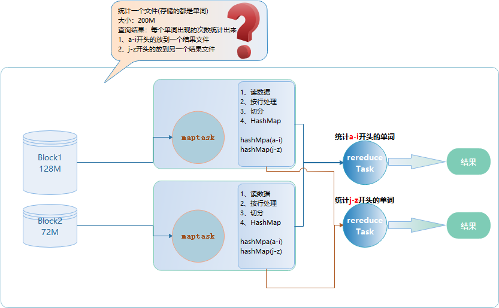
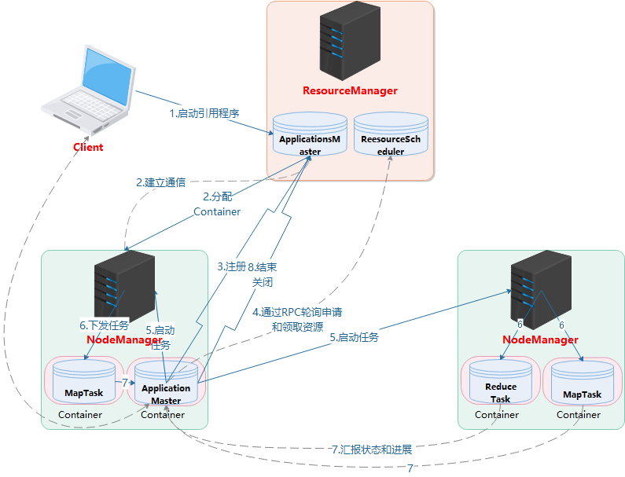

### MapReduce核心编程思想
+ MapReduce运行流程

+ MapReduce编程规范
> + 1、Mapper阶段
> > + 用户自定义Mapper类，需要继承父类Mapper
> > + Mapper的map方法重写(加上对应的业务逻辑)
> > + Mapper的输入数据key，value类型(key，value可以自定义)
> > + map()方法(maptask进程)对每个<key，value>调用一次
> + 2、Reducer阶段(会把相同的key放到一个ReduceTask进行处理)
> > + 用户自定义reducer类，继承父类Reducer 
> > + Reduce的数据输入类型对应的Mapper阶段的输出类型，也是<key,value>
> > + Reduce的reduce方法重写(加上业务逻辑)
> > + ReduceTask的进程对每组的<key,value>调用一次reduce方法
> + 3、 Driver阶段(MR程序需要一个Driver来进行任务的提交，提交的任务是一个描述了各种信息的job对象)
> > + 获取job信息，实例化job和Configuration对象
> > + 设置执行的驱动类
> > + 设置自定义的mapper和reduce类
> > + 设置map的输出入输出类型
> > + 设置reduce的输入和输出类型
> > + 设置输入和输出路径
> > + 提交任务
### MapReduce案例(WordCount案例)
1. [WordCountMapper](WordCountMR/src/main/java/WordCountMapper.java)
2. [WordCountReducer](WordCountMR/src/main/java/WordCountReducer.java)
3. [WordCountDriver](WordCountMR/src/main/java/WordCountDriver.java)
### Yarn任务提交流程(Driver)

