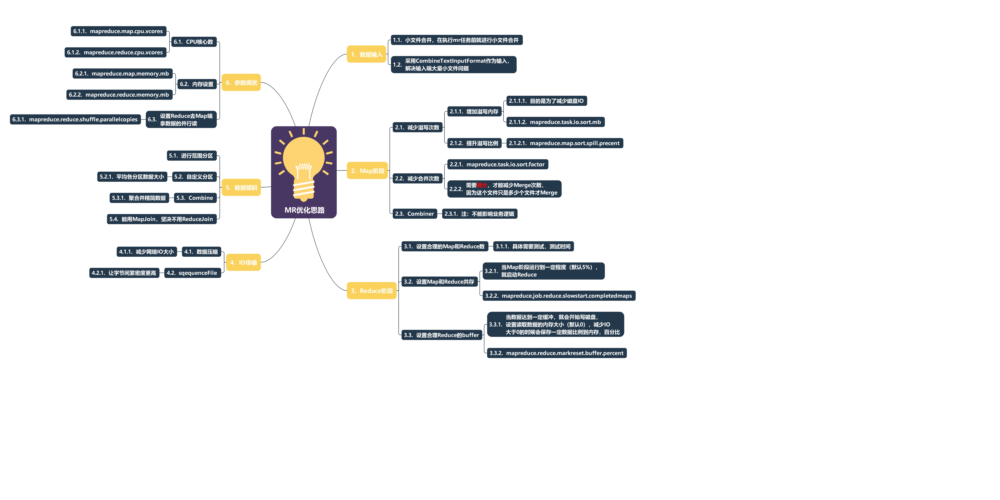

### ★★★★★ Shuffle机制
- 简介：从Map输出到Reduce输入的整个过程可以广义的成为Shuffle。Shuffle横跨Map端和Reduce端，在Map端包括Spill过程，在Reduce
端包括copy和sort过程
- 合并与归并区别
    - 合并：依托于上次溢写的结果，进行合并，是每个分区内的合并
    - 归并：把两次溢写的结果进行合并，是多个相同分区合并成一个
- 过程：
> Map后写入数据到环形缓冲区(默认100M，80%溢写)，发送溢写后进行默认分区、排序、合并(可选局部合并)，溢写多次(例如2次)
都完成进行归并，context进行写道磁盘，会根据相同分区进行内存缓存方式写入，不同的分区会进行不同ReduceTask(默认的数量为1)
，输出的结果文件是以reduceTask决定，如果2个分区，虽然是两个reduceTask，但是还会进行合并，因此最终的输出结果数量是以设置
为准。若进行内存缓存过程中，内存不足情况下，会溢写道磁盘，然后进行归并、排序，在按照相同的key进行分组
- 流程图： 

- 详解：
1. Collect阶段：每个Map任务不断地以<key, value>对的形式把数据输出到在内存中构造的一个环形数据结构中。使用环形数据结构
是为了更有效地使用内存空间，在内存中放置尽可能多的数据
    - 环形缓冲区：这个数据结构其实就是个字节数组，叫Kvbuffer，这里面放置了<key, value>数据和索引数据，给放置索引数据的区
域起了一个Kvmeta的别名，在Kvbuffer的一块区域上穿了一个IntBuffer（字节序采用的是平台自身的字节序）的马甲。<key, value>
数据区域和索引数据区域在Kvbuffer中是相邻不重叠的两个区域，用一个分界点来划分两者，分界点不是亘古不变的，而是每次Spill之
后都会更新一次。初始的分界点是0，<key, value>数据的存储方向是向上增长，索引数据的存储方向是向下增长，默认100M（大小可设置）
，>=80%发生溢写， 索引数据包括value的起始位置、key的起始位置、partition值、value的长度
2. Sort阶段：先把Kvbuffer中的数据按照partition值和key两个关键字升序排序，移动的只是索引数据，排序结果是Kvmeta中数据按照
partition为单位聚集在一起，同一partition内的按照key有序。
3. Spill阶段：Spill线程为这次Spill过程创建一个磁盘文件：创建一个类似于“spill12.out”的文件。Spill线程根据排过序的
Kvmeta挨个partition的把<key, value>数据吐到这个文件中，一个partition对应的数据吐完之后顺序地吐下个partition，直到把所有的
partition遍历完。一个partition在文件中对应的数据也叫段(segment)。
4. Copy阶段：
    - Reduce任务拖取某个Map对应的数据，默认存内存中，Reduce要向每个Map去拖取数据，在内存中每个Map对应一块数据，当内存中
存储的Map数据占用空间达到一定程度的时候，开始启动内存中merge，把内存中的数据merge输出到磁盘上一个文件中。 
    - 如果在内存中不能放得下这个Map的数据的话，直接把Map数据写到磁盘上，从HTTP流中读取数据然后写到磁盘，使用的缓存区
大小是64K。拖一个Map数据过来就会创建一个文件，当文件数量达到一定阈值时，开始启动磁盘文件merge，把这些文件合并输出到一个文件。
    - 有些Map的数据较小是可以放在内存中的，有些Map的数据较大需要放在磁盘上，这样最后Reduce任务拖过来的数据有些放在内存
中了有些放在磁盘上，最后会对这些来一个全局合并
6. Merge sort： 这里使用的Merge和Map端使用的Merge过程一样。Map的输出数据已经是有序的，Merge进行一次合并排序，所谓
Reduce端的sort过程就是这个合并的过程。一般Reduce是一边copy一边sort，即copy和sort两个阶段是重叠而不是完全分开的。
### ★★ MapReduce优化点
- MapReduce瓶颈
> - 计算机性能
> > 1. CPU：逻辑运算
> > 1. 内存：大小、频率
> > 1. 磁盘：IO读写能力、大小
> > 1. 网络：带宽
> - I/O
> > 1. 数据倾斜：数据到Reduce进行汇总，如果有一个ReduceTask中的数据过大，会导致整个程序的效率很低
> > 1. Map和Reduce数设置不合理
> > 1. Map运行时间过长，导致Reduce等待过久
> > 1. 小文件过多：因无论文件多大，都会分配元数据信息，如果过多就导致浪费资源、存储空间
> > 1. MR中有大量不可分块的超大文件，在shuffle阶段会不断溢写
> > 1. 多个溢写的小文件，需要多级Merge
- 优化方案思维图

