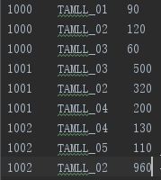
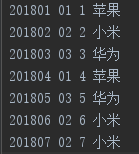
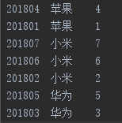

### 案例1：自定义分区和排序的流量统计
需求：
1. 分区：按照不同的手机号码前三位进行分区，前三位相同的分到一个区
2. 排序：根据用户每月使用的流量按照使用的流量进行排序
分区需求分析：
- 发生阶段：分区发生在MapTask溢写阶段
- 父类：Partitioner 类
- Hadoop默认采用的HashPartition，源码如下
```java
package org.apache.hadoop.mapreduce.lib.partition;
import org.apache.hadoop.classification.InterfaceAudience;
import org.apache.hadoop.classification.InterfaceStability;
import org.apache.hadoop.mapreduce.Partitioner;
/** Partition keys by their {@link Object#hashCode()}. */
@InterfaceAudience.Public
@InterfaceStability.Stable
public class HashPartitioner<K, V> extends Partitioner<K, V> {
  /** Use {@link Object#hashCode()} to partition. */
  public int getPartition(K key, V value,
                          int numReduceTasks) {
    return (key.hashCode() & Integer.MAX_VALUE) % numReduceTasks;
  }
}
```
分区需求实现：
1. 根据源码格式自定义分区FlowCountPartition   
2. [自定义分区代码](MapReduceCase/src/main/java/FlowCountCase/FlowCountPartition.java)
3. Driver设置Partitioner和ReduceTask数量
```java
// 设置自定义分区类和结果文件，结果文件默认为1
job.setPartitionerClass(FlowCountPartition.class);
// 并自定义Reduce个数，需要比分区更大，因为还有除了自定义了还有其他的
job.setNumReduceTasks(6);
```
- [完整分区代码](MapReduceCase/src/main/java/FlowCountCase)

排序需求分析：
- 发生阶段：发生在MapTask溢写阶段
- 父类：WritableCompareable
- 实现方案：在Map传输数据中从写排序方法compareTo
- 排序操作在Hadoop中默认的行为，默认是按照字典排序  
- 排序分类
    1. 部分排序：根据输入的键值对进行排序，保证输出的内部经过排序的。
    2. 全部排序：一个分区进行排序.https://www.cnblogs.com/yiwanfan/p/9098366.html
    3. 辅助排序：多次排序，先对key排序，然后对key里面的值进行排序
    4. 二次排序：https://blog.csdn.net/u014307117/article/details/46289169     

排序需求实现
+ 排序定义在输出Value中，例如流量统计的FlowBean
    + [排序数据类](MapReduceCase/src/main/java/FlowCountCase/FlowSortBean.java)
    + [完整案例代码](MapReduceCase/src/main/java/FlowCountCase)

### 合并组件Combiner优化案例
+ 父类：Reducer
+ 发生阶段：MapTask输出到磁盘归并的时候进行合并，减少传输入Reducer阶段的数量
+ 作用：局部汇总，减少网络传输量，进而优化程序
> - 注：只能用到不影响业务逻辑的情况，例如单词统计，不适用于影响业务最终逻辑的情况，例如求平均值
> - 平均值例：   
Mapper阶段：分区1 (3+5+7)/3=5    
            分区2 (2+6)/2=4   
            结果：(4+5)/2=4.5 是错误的
+ 注：代码和自定义的Reducer一样，只是发生的阶段不一样，可以直接在Driver把Reducer换成Combiner
```java
// job.setReducerClass(FlowCountReducer.class);
job.setCombinerClass(FlowCountReducer.class);
```

### 案例2：订单数据分析
需求：求出每个订单中最贵的商品     
数据格式：       
      
需求分析：
1. 需要对订单id进行全局正序排序，成交额倒序排序
2. 不同的订单id存放到不同的文件，需要更具订单id进行分区
3. 辅助排序中相同的id区第一个放到对应的文件
全局排序：
+ 接口：WritableCompartable
+ 实现：compareTo方法
+ 说明：1 -- 正序，-1 -- 倒序，0 -- 不进行排序，且只取一个      
辅助排序：
+ 父类：WritableComparator
+ 重写：compare方法
+ 注意：辅助排序必须加如下构造，是根据什么进行二次排序，super里面加对应的类   
```java
public class OrderGroupingComparator extends WritableComparator {
     // 辅助排序该构造必须加，规范， 是根据什么来进行二次排序，super里面加对应的类
     protected OrderGroupingComparator() {
           super(OrderBean.class, true);
     }
```
全局排序核心代码：   
```java
    // 排序，ID正序，价格倒序
     @Override
     public int compareTo(OrderBean o) {
           int rs;
           // ID排序,当前id大于下一个id，往下排为1往上排为-1
           if (order_id > o.order_id) {
                // id大的往下排
                rs = 1;
           }else if(order_id < o.order_id) {
                rs = -1;
           }else {
                // id相等的价格高的往上排
               rs = order_price > o.order_price ? -1 : 1;
           }
           return rs;
```
辅助排序代码：     
```java
package com.itstar.order;
import org.apache.hadoop.io.WritableComparable;
import org.apache.hadoop.io.WritableComparator;
/**
 *
 * @author CDMloong
 * 这个是reducer的分组排序
 */
public class OrderGroupingComparator extends WritableComparator {
     // 辅助排序该构造必须加，规范， 是根据什么来进行二次排序，super里面加对应的类
     protected OrderGroupingComparator() {
           super(OrderBean.class, true);
     }
     // 重写比较
     public int compare(WritableComparable a, WritableComparable b) {
           OrderBean a_bean = (OrderBean) a;
           OrderBean b_bean = (OrderBean) b;          
           int rs;
           // order_id不同不是同一个对象
           if (a_bean.getOrder_id() > b_bean.getOrder_id()) {
                rs = 1;
           }else if(a_bean.getOrder_id() < b_bean.getOrder_id()) {
                rs = -1;
           }else {
                // id相同，不进行操作，直接返回0，只拿到了第一行的数据
                rs = 0;
           }
           return rs;
     }
}
```
[案例完整代码](MapReduceCase/src/main/java/OrderMR)

### 案例3：小文件合并(自定义InputFormat实现)
背景：
+ 多个小文件情况下，若直接使用默认的**TextInputFormat**会消耗IO资源
需求：
+ 采用在输入MapTask前进行小文件合并
+ 小文件合并为一个文件后需要知道原始文件的路径和对应的内容，存储格式：文件路径+文件内容，例如：c:/a.text aaaaa
思路：
+ 通过自定义InputFormat实现，需要继承FileInputFormat，按照源码的格式进行自定义
实现：
1. 自定义FuncFileInputFormat，继承FileInputFormat。[代码](MapReduceCase/src/main/java/FuncInputFormat/FuncFileInputFormat.java)
2. 【核心点】自定义读取方式FuncRecordReader，继承RecordReader。[代码](MapReduceCase/src/main/java/FuncInputFormat/FuncRecordReader.java)      
3. 常规MapReduce编程
4. 设置自定义的读取方式      
```java
//设置自定义读取方式
job.setInputFormatClass(FuncFileInputFormat.class);
```
[完整案例代码](MapReduceCase/src/main/java/FuncInputFormat)
### 案例4：文件过滤(自定义OutPutFormat实现)
+ 原始日志数据示例：       
```
www.baidu.com   
www.souhu.com   
hadoop.apache.org   
hbase.apache.org    
www.jd.com
```      
+ 需求：
    + 过滤用户访问网址的日志内容，过滤指定内容的网址放一个文件
    + 把包含apache的网址放到文件apache.txt文件中
    + 其他非apache的网址放到other.txt文件中 
+ 思路：
    1. 自定义FileOutputFormat，并重写齐总的getRecordWriter方法[代码](MapReduceCase/src/main/java/logFilter/FuncOutputFormat.java)
    2. 自定义RecordWriter类，重写RecordWriter中的write和close；[代码](MapReduceCase/src/main/java/logFilter/FuncRecorderWriter.java)
    4. 在重写write方法时候回到需求我们需要写到两个自定义结果文件中，因此需要自定义输出文件，则需要写该类的构造方法
    5. 需要自定义两个输出文件，则需要HDFS框架中的FileSystem系统，这需要获取到，FileSystem需要配置文件ConFiguration，
    配置文件是从job中获取，则构造函数里面需要传入job
+ [完整案例代码](MapReduceCase/src/main/java/logFilter)

### 案例5：订单表&商品表合并
+ 原始数据示例：
    + 订单表   
    
        |订单号|商品ID|订单ID|
        |----|----|----|
        |201801|01|1|
        |201802|02|2|
        |201803|03|3|
        |201804|01|4|
        |201805|03|5|
        |201806|02|6|
        |201807|02|7|
    + 商品表   
    
        |商品ID|商品名称|
        |----|----|
        |01|苹果|
        |02|小米|
        |03|华为|
+ 需求：把订单表中的加上商品名称或者商品编号换成商品名称
+ 方案1：MapJoin  [可直接运行代码](MapReduceCase/src/main/java/OrderMapJoin)
    + 商品表较小，可以在Map初始化的时候加入到缓存中
    + Mapper阶段是读入数据，在Map端输出前进行商品名称替换或追加
    + 重写Mapper中的steup方法把商品表通过缓冲流BufferedReader来读入到hashMap中
    + 重写map方法，通过获取到商品的id，然后通过id获取到商品名称，并替换或追加到后面
+ 注意事项：
    + 因为没用到Reducer，因此不需要设置Reducer和对应的输出可以和value
    + 并且同时需要设置ReduceTask的任务数为0，因为默认是1，且本方案不用到
+ 测试结果：     

+ 方案2：ReducerJoin  [可直接运行代码](MapReduceCase/src/main/java/OrderReducerJoin)
    + 封装一个商品的对象，对象中包括order_id、pid(产品ID)、amount(商品数量)、pName(商品名称)、flag(区分是什么表格)
    [代码](MapReduceCase/src/main/java/OrderReducerJoin/OrderJoinBean.java)
    + Mapper阶段区分是什么表格，设置以商品ID为key的值，其他字段有的对应设置，无的填写空进行输出到reducer
    [代码](MapReduceCase/src/main/java/OrderReducerJoin/OrderJoinMapper.java)
    + Reducer阶段通过标记区分表格，如果是订单表格，把对应的值拷贝到临时变量，并添加到一个列表中，如果不是则放到商品变量中,
    最后循环列表，把商品的变量中的名称替换成列表元素中的商品id，进行输出,
    [代码](MapReduceCase/src/main/java/OrderReducerJoin/OrderJoinReducer.java)
+ 测试结果：     

### 数据压缩
+ 背景：MR的操作过程中实际是数据的流入和流出的过程，在进行计算肯定会进行大量的数据传输，如果需要提升性能，
我们可以通过压缩来，减少数据来提升性能。
+ 作用：
    + 能够有效的减少底层存储(HDFS)读写字节数；
    + 提高网络宽带和磁盘空间的效率，减少网络IO；
    + 有效的节省资源；
    + 压缩是mr程序的优化策略，是通过减少mapper或reducer的传输进行数据的压缩，以减少磁盘IO
+ ☆☆☆☆基本原则：
    + **运算密集型的任务经历少用压缩；**
    + IO密集型的任务，多用压缩；
+ MR支持的压缩编码     

|压缩格式|Hadoop是否自带|文件拓展名|是否可以切分|编码/解码器|原始文件(GB)|压缩后(GB)|压缩速率(MB/S)|
|---|---|---|---|---|---|---|---|
|Default|是|.default|否|org.apche.hadoop.io.compress.DefaultCodeC|-|-|-|-|
|Gzip|是|.gz|否|org.apche.hadoop.io.compress.GzipCodeC|8.3|1.8|17.5|58|
|bzip2|是|.bz2|是|org.apche.hadoop.io.compress.BZip2CodeC|8.3|1.1|2.4|9.5|
|LZO|否|.lzo|是|com.hadoop.compression.lzo.lzoCodeC|8.3|2.9|49.3|74.6|
|Snappy|否|.snappy|否|org.apche.hadoop.io.compress.SnappyCodeC|-|-|-|-|

+ Map端设置方法
    1. 在配置中(conf)中开启数据压缩
    2. 在配置中(conf)中设置压缩方式
    ```java
    // 1.获取job信息
    Configuration conf = new Configuration();
    Job job = Job.getInstance(conf);
    // 开启map端的数据压缩
    conf.setBoolean("mapreduce.map.output.compress", true);
    // 设置压缩方式,指定压缩，压缩方式是默认
    conf.setClass("mapreduce.map.output.compress.codec", DefaultCodec.class, CompressionCodec.class);
    // 压缩方式为Gzip
    conf.setClass("mapreduce.map.output.compress.codec", GzipCodec.class, CompressionCodec.class);
    // 压缩方式为BZip2
    conf.setClass("mapreduce.map.output.compress.codec", BZip2Codec.class, CompressionCodec.class);
    // 2.获取jar包
    job.setJarByClass(OrderDriver.class);
    ```
+ Reduce端设置方法
    1. 输出格式(FileOutputFormat)中开启数据压缩
    2. 输出格式(FileOutputFormat)中设置压缩方法
    ```java
    // 开启reduce端的输出压缩
    FileOutputFormat.setCompressOutput(job, true);
    // 设置默认压缩方法
    FileOutputFormat.setOutputCompressorClass(job, DefaultCodec.class);
    // 设置BZip2压缩方式
    FileOutputFormat.setOutputCompressorClass(job, BZip2Codec.class);
    // 设置Gzip压缩方法
    FileOutputFormat.setOutputCompressorClass(job, GzipCodec.class);
    // 9.设置输入输出格式
    FileInputFormat.setInputPaths(job, new Path("E:\\order\\in"));
    FileOutputFormat.setOutputPath(job, new Path("E:\\order\\out"));
    ```
+ 压缩测试代码示例      
```java
import java.io.File;
import java.io.FileInputStream;
import java.io.FileOutputStream;
import java.io.IOException;
import org.apache.hadoop.conf.Configuration;
import org.apache.hadoop.io.IOUtils;
import org.apache.hadoop.io.compress.CompressionCodec;
import org.apache.hadoop.io.compress.CompressionOutputStream;
import org.apache.hadoop.util.ReflectionUtils;

/**
* @author :FinalLong
* @date : 2018年10月31日 下午10:17:54
* @version ：1.0 类说明
*/
public class TestCompress {
    public static void main(String[] args) throws ClassNotFoundException, IOException {
        Compress("e:\\123","org.apache.hadoop.io.compress.DefaultCodec");
    }
    // 测试压缩方法
    private static void Compress(String filename, String method) throws ClassNotFoundException, IOException {
        // 1.获取输入流
        FileInputStream fis = new FileInputStream(new File(filename));
        // 2.反射机制，获取class
        Class className = Class.forName(method);
        CompressionCodec codec = (CompressionCodec) ReflectionUtils.newInstance(className, new Configuration());
        // 输出流
        FileOutputStream fos = new FileOutputStream(new File(filename + codec.getDefaultExtension()));
        // 创建压缩方式
        CompressionOutputStream cos = codec.createOutputStream(fos);
        IOUtils.copyBytes(fis, cos, 1024 * 1024 * 2, false);
        // 关闭资源
        fis.close();
        cos.close();
        fos.close();
    }
}
```


