### 安装
1. 下载上传：官网(http://hive.apache.org/)ALT+P：上传到节点      
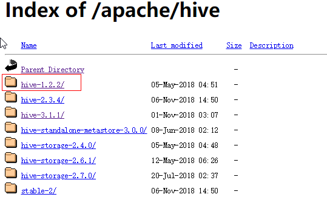
2. 解压：tar -zxvf apache-hive-1.2.2-bin.tar.gz -C /root/hd
3. [可选]修改hive文件夹名称 ：mv /root/hd/apache-hive-1.2.2-bin/ /root/hd/hive/
4. 修改配置文件hive-env.sh
    1. 更改配置文件名称：mv hd/hive/conf/hive-env.sh.template /root/hd/hive/conf/hive-env.sh
    2. 配置hadoop路径：    
    HADOOP_HOME=/root/hd/hadoop-2.8.5
    3. 配置hive配置文件路径：    
    export HIVE_CONF_DIR=/root/hd/hive/conf
5. 修改配置文件hive-site.xml：vi /root/hd/hive/conf/hive-site.xml      
增加如下配置：     
\<property>      
    \<name>hive.cli.print.header\</name>      
    \<value>true\</value>     
    \</property>     
\<property>      
    \<name>hive.cli.print.current.db\</name>      
    \<value>true\</value>     
\</property> 
5. 启动hdfs：start-dfs.sh
6. 启动yarn：start-yarn.sh     
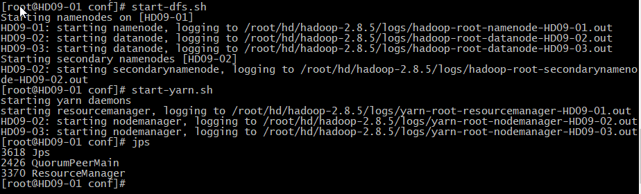
7. hdfs创建目录：hdfs dfs -mkdir /tmp; hdfs dfs -mkdir -p /user/hive/warehouse
8. 修改权限：hdfs dfs -chmod 777 /tmp；hdfs dfs -chmod 777 /user/hive/warehouse
9. 启动hive：bin/hive
10. 测试hive是否安装成功：
    1. 查看数据库：show databases;
    2. 使用数据库：use default;
    3.  查看表：show tables;
    4. 创建表：create table itstar(id int，name string);
### 替换数据库为mysql
+ 原因：Hive默认**deploy数据库不支持多客户端操作**，严重缺陷，因此安装mysql来替代deploy
##### 安装MySql：
1. 检查是否有安装mysql：yum list installed | grep mysql     

2. 如果有则删除：yum -y remove 数据库名称
3. 安装依赖：yum search libaio；yum install libaio        
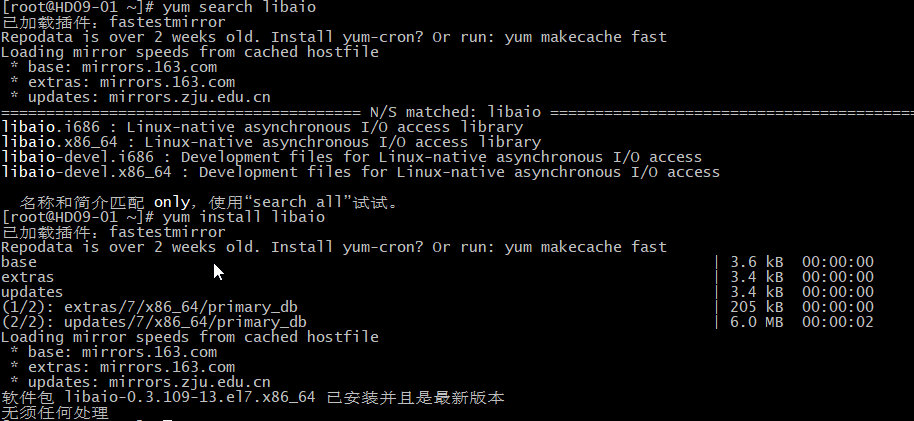
4. 安装wget(不存在情况)：yum install wget       
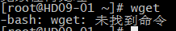
5. 下载 MySQL Yum Repository：wget http://repo.mysql.com/mysql-community-release-el7-5.noarch.rpm
6. 安装 MySQL Yum Repository：rpm -ivh mysql-community-release-el7-5.noarch.rpm 或 yum localinstall mysql-community-release-el7-5.noarch.rpm
7. 验证 MySQL Yum Repository是否安装成功：yum repolist enabled | grep "mysql.\*-community.\*"      
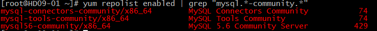
8. (可选)查看MySql版本：yum repolist all | grep mysql
9. (可选)查看当前可用的Mysql版本：yum repolist enabled | grep mysql
10. 安装MySql：yum install mysql-community-server
    1. 安装完成包括，mysql-community-server、mysql-community-client、mysql-community-common、mysql-community-libs 四个包
    2. 查看mysql目录：whereis mysql
11. 启动mysql：systemctl start mysqld
    1. 查看状态：systemctl status mysqld
    2. 查看版本：mysqladmin --version
12. mysq修改密码：
    1. 切换数据库：use mysql
    2. 修改密码：update user set password=password('新密码') where user='要更新密码的用户名'
    3. 刷新权限：flush privileges
    4. 重启服务：service mysqld restart
13. (需远程连接情况)远程访问 MySQL， 需开放默认端口号 3306：
    1. firewall-cmd --permanent --zone=public --add-port=3306/tcp
    2. firewall-cmd --permanent --zone=public --add-port=3306/tcp
    3. firewall-cmd --reload
14. (需外部连接情况)关闭防火墙
    1. firewall-cmd --state  --查看防火墙状态
    2. systemctl stop firewalld -- 关闭防火墙
    3. systemctl disable firewalld -- 禁止启动防火墙
##### 配置Hive数据库
1. 配置驱动：
    1. 下载：wget http://dev.mysql.com/get/Downloads/Connector-J/mysql-connector-java-5.1.39.tar.gz
    2. 解压：tar -zxvf mysql-connector-java-5.1.39.tar.gz
    3. 拷贝：cp /root/mysql-connector-java-5.1.39/mysql-connector-java-5.1.39-bin.jar /root/hd/hive/lib/
2. 配置配置文件：
    1. 新建配置文件：touch /root/hd/hive/conf/hive-site.xml
    2. 修改配置文件：vi /root/hd/hive/conf/hive-site.xml,增加内容并修改，自行修改主机名称、mysql账号密码 
    ```xml
    <?xml version="1.0"?>
    <?xml-stylesheet type="text/xsl" href="configuration.xsl"?>
    <configuration>
       <property>
           <name>javax.jdo.option.ConnectionURL</name>
               <value>jdbc:mysql://Hadoop01:3306/metastore?createDatabaseIfNotExist=true</value>
               <description>设置元数据库存放地址</description>
       </property>
       <property>
           <name>javax.jdo.option.ConnectionDriverName</name>
           <value>com.mysql.jdbc.Driver</value>
           <description>指定JDBC驱动</description>
       </property>
        <property>
            <name>javax.jdo.option.ConnectionUserName</name>
           <value>root</value>
           <description>mysql账号</description>
       </property>
       <property>
            <name>javax.jdo.option.ConnectionPassword</name>
           <value>root</value>
           <description>mysql密码</description>
       </property>
    </configuration>
    ```
3. **若已经启动hive，需要重启hive，bin/hive**
### 数据类型
|Java数据类型|Hive数据类型|长度|类型名称|
|---|---|---|---|
|byte|TINYTNT|1字节|-|
|short|SMALTNT|2字节|小整型|
|int|INT|4字节|整型|
|long|BIGINT|8字节|长整型|
|float|FLOAT|4字节|单精度浮点数|
|double|DOUBLE|8字节|双精度浮点数|
|string|STRING|2字节|字符类型|
|-|TIMESTAMP|2字节|时间类型|
|-|BINARY|-|字节数组|

### DDL(数据库定义语言)
+ 创建数据库
1. 标准：CREATE DATABASE IF NOT EXISTS *table_name*;
2. 创建到hdfs指定路径：CREATE DATABASE *table_name* LOCATION *'hdfs_path'*;
+ 修改数据库
1. 查询数据库结构：DESC DATABASE *table_name*;
2. 添加描述信息：ALTER DATABASE *table_name*  DBPROPERTIES('描述信息');
3. 查看拓展信息：DESC DATABASE EXTENDED *table_name*;
+ 查询数据库：
1. 显示数据库：SHOW DATABASE;
2. 筛选数据库：SHOW DATABASE LIKE 'db*';
+ 删除数据库：DROP DATABASE IF EXISTS *table_name*;
+ 创建表：CREATE TABLE *table_name(column_name column_type)* ROW FORMAT DELIMITED FIELDS TERMINATED BY *"\t"*;
+ 管理表(内部表)：
1. 不擅长做数据共享，删除hive中的管理表，数据也同时会删除，hive上面只是表，hdfs上面存储数据
2. 有数据计算、数据传输的情况会走MR程序，例如计算有多少行、查询数据放入新表等
3. 加载数据：LOAD DATA LOCAL INPATH *'file_path'* INTO TABLE *table_name*;
4. 查询的数据插入新表：CREATE TABLE IF NOT EXITS *new_table_name* AS SELECT * FROM *old_table_name* WHERE *column_name='value'*;
5. 查询表结构：DESC FORMATTED *table_name*;
+ 管理表(外部表)：
1. Hive不认为这张表拥有这份数据，删除该表，数据不删除，擅长做数据共享
2. 创建：CREATE EXTERNAL TABLE IF NOT EXISTS *table_name(column_name column_type)* ROW FORMAT DELIMITED FIELDS TERMINATED BY *"\t"*;
3. 删除后重新创建管理表 CREATE TABLE IF NOT EXISTS *table_name(column_name column_type)*  ROW FORMAT DELIMITED FIELDS TERMINATED BY *"\t"*; (数据会自动关联)
+ 创建分区表：
CREATE TABLE *table_name(column_name column_type)* PARTITIONED BY (day string)  ROW FORMAT DELIMITED FIELDS TERMINATED BY *'\t'*;    
**注：按照时间分区 day string**     
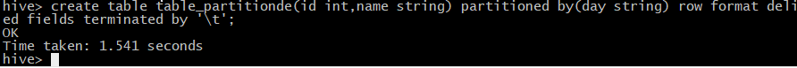
+ 导入数据：LOAD DATA LOCAL INPATH *'file_path'* INTO TABLE *table_name* PARTITION(day=*day_value*);      
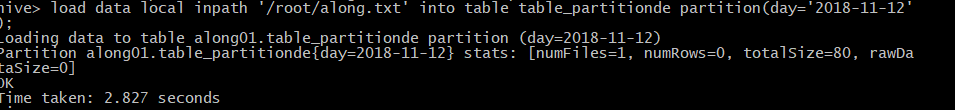
+ 单分区查询：SELECT * FROM *table_name* WHERE *day=day_value*;   
**注：不加条件会查询所有的分区数据**    
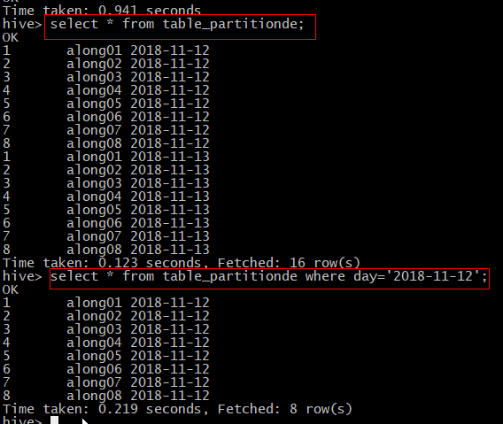
+ 添加分区：ALTER TABLE *table_name* ADD PARTITION(*day=day_value*)；
+ 表结构查询：DESC FORMATTED *table_name*;      

+ 删除指定分区表：ALTER TABLE *table_name* DROP PARTITION(day=*day_value*),PARTITION(day=*day_value*);
+ 修改表名：ALTER TABLE *table_name* RENAME TO *new_table_name*;
+ 添加列：ALTER TABLE *table_name* ADD COLUMNS (*new_column string*);       
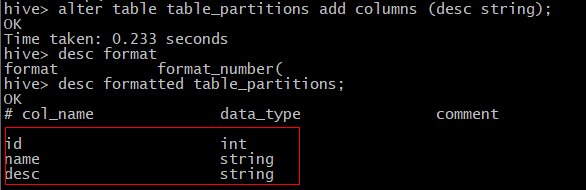
+ 更新列类型：ALTER TABLE *table_name* CHANGE COLUMN *old_column new_column int*;
+ 替换列：ALTER TABLE *table_name* REPLACE COLUMNS(*column_name_new column_type_new*);      
**注：相当于重定义，原来的数据也会丢失**
### DML(数据操控语言)
+ 本地加载数据：LOAD DATA LOCAL INPATH *'file_path'* INTO TABLE *table_name*;
+ 加载HDFS数据：LOAD DATA INPATH *'hdfs_path'* INTO TABLE *database_name.table_name*;      
注：相当于剪切，把数据剪切到hdfs目录去了
+ 数据覆盖：LOAD DATA LOCAL INPATH *'file_path'* OVERWRITE INTO TABLE *table_name*;
+ 向分区表插入数据：INSERT INTO TABLE *table_name* PARTITION(*month='201811'*) VALUES (*value，value*);
+ 按条件查询后放入新表：CREATE TABLE IF NOT EXISTS *table_name_new* AS SELECT * FROM *table_name* WHERE *column_name = value*;
+ 创建表的时候导入数据：CREATE TABLE *table_name(column_name column_type)* ROW FORMAT DELIMITED FIELDS TERMINATED BY '\t' LOCATION *'hdfs_file_path'*;
+ 数据导出：INSERT OVERWRITE LOCAL DIRECTORY *'local_file_path'* SELECT * FROM *table_name* WHERE *column_name = value*;     
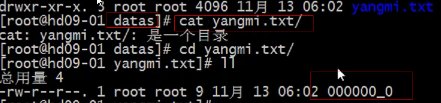
+ 数据导出(hive shell方式)：bin/hive -e "SELECT * FROM *table_name*" > *local_file_name*     加where需要外面双引号，里面单引号       
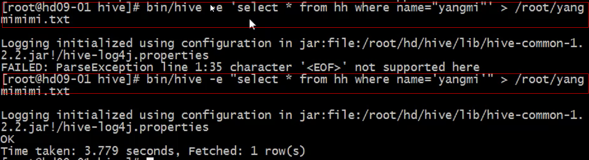
+ 数据导出(hadoop方式)：dfs -get *hdfs_file_path* *local_file_path*
+ 清空表格：TRUNCATE TABLE *table_name*;
### 算术运算符
|运算符|描述|
|---|---|
|+|相加|
|-|相减|
|*|相乘|
|/|相除|
|%|取余|
|1|按位取或|
|^|按位异或|
|~|按位取反|
### 函数
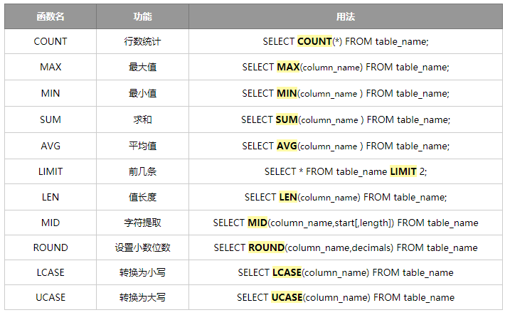
### Where语句使用
1. 工资大于1700的员工信息：SELECT * FROM table_name WHERE column_name >1700;
2. 工资小于1800的员工信息：SELECT * FROM table_name WHERE column_name <1800;
3. 查询工资在1500到1800之间的信息：SELECT * FROM table_name WHERE column_name BETWEEN 1500 AND 1800;
4. 查询有奖金的员工信息：SELECT * FROM table_name WHERE column_name IS NOT NULL;
5. 查询无奖金的员工信息：SELECT * FROM table_name WHERE column_name NOT NULL；
6. 查询工资是1700或1900的员工信息：SELECT * FROM table_name WHERE column_name IN(1700,1900);
### LIKE使用
+ 使用场景：
1. 选择类似的值
2. 选择条件可以包含字母和数字
+ 案例
1. 查询员工薪水第二位为6的员工信息：SELECT * FROM table_name WHERE LIKE  '_6%';
    1.  注：_ 表示一个字符，% 表示0-n个字符
2. 查询员工薪水包含7的员工信息：SELECT * FROM table_name WHERE LIKE '%7%';
### GROUP BY使用
1. 计算empt表中每个部门的平均工资    
SELECT AVG(empt.sal) AS avg_sal,empt.deptno FROM empt GROUP BY empt.deptno；
1. 计算empt每个部门中最高的薪水     
SELECT MAX(empt.sal) AS max_sal, empt.deptno FROM empt GROUP BY empt.deptno;
1. 计算部门的平均薪水大于1700的部门       
SELECT AVG(empt.sal) AS avg_sal,empt.deptno FROM empt GROUP BY empt.deptno HAVING avg_sal>1700;     
**注意：如果想在分组GROUP BY后面加条件需要用 HAVING，HAVING只用于GROUP BY分组统计语句中，WHERE 后面不能写GROUP BY函数**
### Join操作
+ 已有数据表
    + dept表(部门表)     
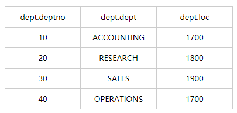
    + empt表(员工表)     
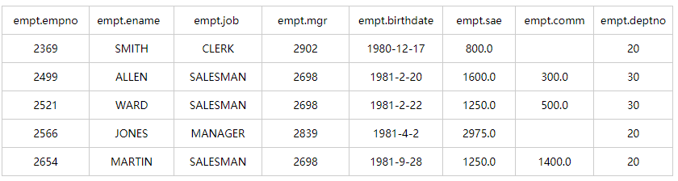
    + local表(地址表)        
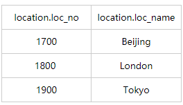
+ 等值Join
    + 需求：根据员工表和部门表中的部门编号相等，查询员工编号、员工名、部门名称
    + 实现：SELECT empt.empno,empt.ename,dept.dept FROM empt JOIN dept ON empt.deptno=dept.deptno;     
    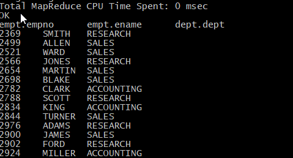      
    **注：使用表别名可以提升查询效率，且避免输错误      
    Hive只支持等值连接，不支持非等值连接(ON 后面只能用=)**
+ 左外连接LEFT JOIN
    + 当左边的表比右边多的时候使用，当右边没有情况，会用null替代
    + SELECT d.deptno,e.empno,e.ename,d.dept FROM dept d LEFT JOIN empt e ON e.deptno=d.deptno;     
    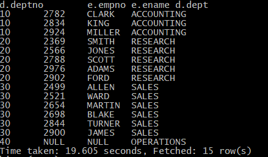
+ 右外连接RIGHT JOIN
    + 当右边的表比左边多的时候使用，当左边没有情况，会用null替代
    + SELECT d.deptno,e.empno,e.ename,d.dept FROM  empt e RIGHT JOIN dept d ON e.deptno=d.deptno;(查询结果和左连接一样)
+ 多表连接查询
    + 需求：查询员工名字、部门名称、地址
    + 实现：SELECT e.ename,d.dept,l.loc_name FROM empt e JOIN dept d ON e.deptno=d.deptno JOIN  location l ON d.loc=l.loc_no;      
    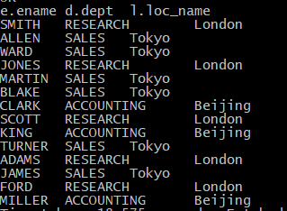
### 笛卡尔乘积
+ 简介： 笛卡尔乘积是指在数学中，两个集合X和Y的笛卡尓积（Cartesian product），又称直积，表示为X × Y，
第一个对象是X的成员而第二个对象是Y的所有可能有序对的其中一个成员
+ 错误的写法，避免：select ename,dept from empt,dept;
+ 规避笛卡尔积方法
    1. hive默认模式是非严格模式，如下        
    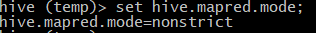
    2. 设置为严格模式：set hive.mapred.mode=strict; 该设置只是对当前会话有效，一直生效需要修改配置文件
    3. 此时执行会出现笛卡尔积的操作会报错，如下     
    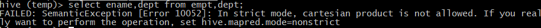
    4. 永久生效修改配置文件方式：vi /root/hd/hive/conf/hive-site.xml，增加如下配置      
    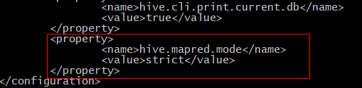
### 排序ORDER BY
1. 全局排序ORDER BY 
+ 查询员工信息按照升序排序
    + 默认：SELECT * FROM empt ORDER BY sae ASC; 
    + 降序：SELECT * FROM empt ORDER BY sae DESC;
+ 查询员工号与员工薪水按照员工二倍工资进行排序        
SELECT empt.empno, empt.sae*2 twosal FROM empt ORDER BY twosal;
1. 分区排序SORT BY
+ 分区表按照员工编号降序       
SELECT * FROM empt DISTRIBUTE BY deptno SORT BY empno DESC;
### 分桶表
+ 用途：主要运用到抽样，数据进行预判
+ 分区&粪桶区别
    + 分区表分的是数据的存储路径
    + 分桶表分的是文件
+ 分桶表创建     
CREATE TABLE emp_buck(id int,name string)   
CLUSTERED by(id) --- 通过什么字段分桶   
INTO 4 BUCKETS   --- 分为几通   
ROW FORMAT DELIMITED FIELDS TERMINATED BY '\t';     
+ 清空表格：TRUNCATE TABLE table_name;
+ 设置属性，开启分桶操作：
1. 查询mapreduce的job配置：set mapreduce.job.reduces;  -1表示未设置reduce数量        
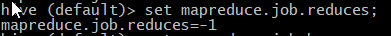
2. 查询属性：set hive.enforce.bucketing;     
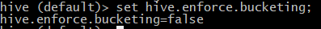
3. 设置属性：set hive.enforce.bucketing=true;        
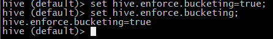
+ 导入数据(子查询方式)       
insert into table emp_buck select * from emp_b;     
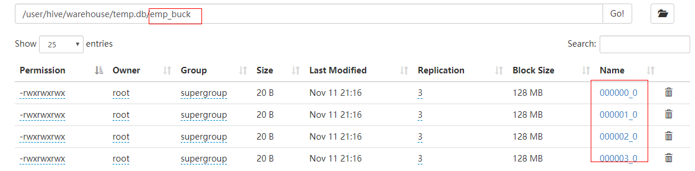
### 自定义函数
+ 三种自定义函数
1. UDF:一进一出(User-Defined-Function)
2. UDAF:多进一出(count、max、min)
3. UDTF:一进多出
+ 自定义函数步骤：
1. IDEA编码，示例：
```java
package com.along.hive;
import org.apache.hadoop.hive.ql.exec.UDF;
/**
* @author :FinalLong
* @version ：1.0
* 类说明
*/
public class Lower extends UDF {
     // 需求是大写转小写
     public String evaluate(final String s) {
           // 判断是否有字母,如果没有则直接
           if(s==null) {
                return null;
           }
           return s.toString().toLowerCase();
     }
}
```
2. 打包为jar包。[推荐：使用Maven插件打包](https://blog.csdn.net/daiyutage/article/details/53739452)
3. 上传到HIVE环境中
4. 启动HIVE并加载到环境中：add jar /root/lower.jar;       
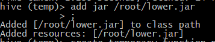
5. 根据jar关联方法:CREATE TEMPORARY FUNCTION my_lower AS "com.along.hive.Lower";     
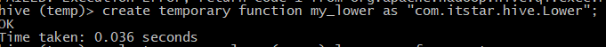
6. 使用自定义方法: SELECT ename,my_lower(ename) lowername FROM empt;       
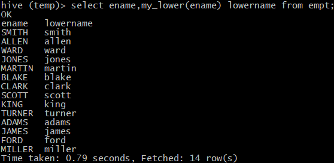
### Hive优化
+ 开启压缩优化
1. 开启Map阶段输出压缩
    1. 查看hive压缩功能状态：set hive.exec.compress.intermediate;
    2. 开启hive压缩功能：set hive.exec.compress.intermediate=true;
    3. 开启map端的压缩功能：set mapreduce.map.output.compress=true;
    4. 设置map端的压缩方式：set mapreduce.map.output.compress.codec=org.apache.hadoop.io.compress.SnappyCodec;
2. 开启Reduce阶段的输出压缩
    1. 开启hive输出的压缩功能：set hive.exec.compress.output=true;
    2. 开启Reduce端的压缩功能：set mapreduce.output.fileoutputformat.compress=true;
    3. 设置Reduce端的压缩方式：set mapreduce.output.fileoutputformat.compress.codec=org.apache.hadoop.io.compress.SnappyCodec;
    4. 设置Reduc输出压缩的类型：set mapreduce.output.fileoutputformat.compress.type=BLOCK;
    5. 测试：insert overwrite local directory '/root/compross/rsout' select * from empt sort by empno desc;    
    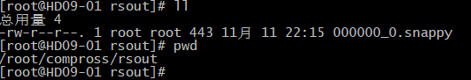
+ 存储优化
1. Hive存储格式：TextFile(default)/SequenceFile/orc/Parquet
    1. orc/Parquet：按照列存储
    1. 行存储：查询速度快，因为是只需要找到第一列，其他的按照顺序的，使用在列较多情况
    1. 列存储：如果查询的字段较少，效率会较高，使用列较少情况
    1. orc特点：
        1. Index Data，是一个轻量级的索引，默认每隔1万行做一次索引；
        1. row Data 存储的为具体的数据；
        1. stripe Footer存储的流的类型，例如长度
        1. Parquet：解决版本依赖的问题
        1. 压缩比例：orc > parquet > textFile
        1. 查询效率：orc > textFile
1. 修改Hive存储格式
    2. 创建表，需要指定存储格式     
    CREATE TABLE itstar_log(time bigint,host string) ROW FORMAT DELIMITED FIELDS TERMINATED BY '\t' STORED AS orc;
    2. 导入数据到普通表，因为指定了存储格式，不能直接导入       
    CREATE TABLE itstar_temp(time bigint,host string) ROW FORMAT DELIMITED FIELDS TERMINATED BY '\t';      
    LOAD DATA LOCAL INPATH 'root/itstar.log' INTO TABLE itstar_temp;
    2. 迁移到指定了格式的表中
    INSERT INTO TABLE itstar_log SELECT * FROM itstar_temp;
    2. HDFS观察大小
+ GROUP BY优化
    + 背景：mr程序，map程序把相同key的数据分发给一个reduce，若一个key的数量较大，会发生数据倾斜；
    + 解决方案：在Map端进行聚合(combiner)，**在Hive中也有类似功能**
        1. 合并：set hive.map.aggr;   默认true   
        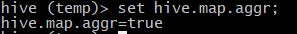
        2. 在有可能发生数据倾斜的程序中，可以设置负载均衡     
        set hive.groupby.skewindata=true;       
        该属性可以均衡reduce，会把map的输出结果随机的分配到reduce中
### 其他
1. 合理避免数据倾斜
    1.1 合理设置Map数量，并不是越多越好，过多业务处理时间还没有开启、初始化的时间更少
    1.2 小文件合并   
    set hive.input.format=org.apache.hadoop.hive.ql.io.CombineHiveInputFormat;
    1.3 合理设置Reuce数量
2 JVM重用：
    1. 一般设置task的任务10-20之间
    2. 修改配置文件:mapreduce.job.jvm.numtasks(mapred-site.xml)
    3. 减少程序的执行时间


