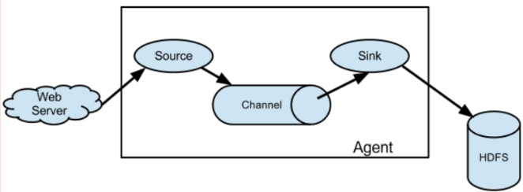
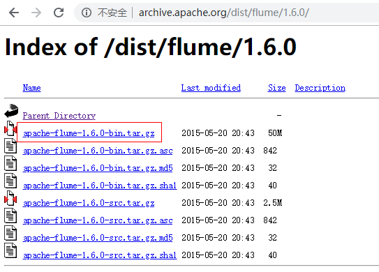
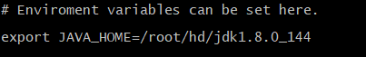
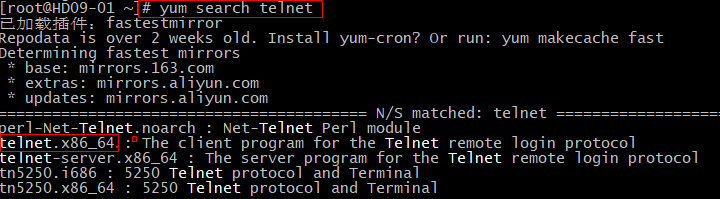
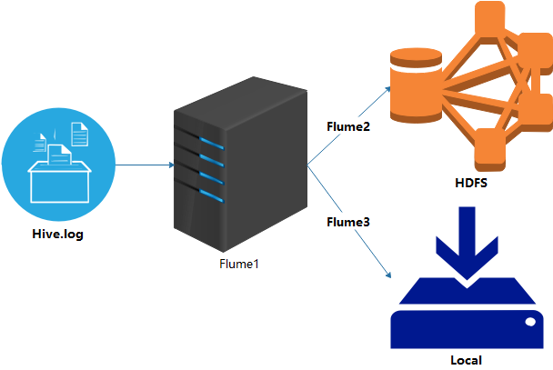

### 简介
+ 官网：http://flume.apache.org/
+ 功能：日志采集工具，Flume是一种分布式，可靠且可用的服务，用于有效地收集，聚合和移动大量日志数据。它具有基于流数据流的
简单灵活的架构。它具有可靠的可靠性机制和许多故障转移和恢复机制，具有强大的容错能力。它使用简单的可扩展数据模型，
允许在线分析应用程序。
### 架构

+ Source：数据源。       
> - Source是数据的收集端，负责将数据捕获后进行特殊的格式化，将数据封装到事件（event） 里，
然后将事件推入Channel中。 Flume提供了很多内置的Source， 支持 Avro，log4j，syslog 和http post(body为json格式)。
可以让应用程序同已有的Source直接打交道，如AvroSource，SyslogTcpSource。 如果内置的Source无法满足需要， 
Flume还支持自定义Source。      


+ Channel:传输通道
> - Channel是连接Source和Sink的组件，大家可以将它看做一个数据的缓冲区（数据队列），它可以将事件暂存到内存中也可以持久化
到本地磁盘上，直到Sink处理完该事件。介绍两个较为常用的Channel，MemoryChannel和FileChannel。     


+ Sink：下沉，存放位置或其他Agent
> - Sink从Channel中取出事件，然后将数据发到别处，可以向文件系统、数据库、 hadoop存数据， 也可以是其他agent的Source。
在日志数据较少时，可以将数据存储在文件系统中，并且设定一定的时间间隔保存数据。
+ Event：传输单元
> - Flume数据传输的基本单元，以事件的形式将数据送往目的地。
### 安装部署
1. 下载：http://archive.apache.org/dist/flume/     

2. 上传，解压：ALT+P tar -zxvf *.tar
3. 重命名：mv flume-env.sh.template flume-env.sh
4. 修改配置文件：vi /root/hd/apache-flume-1.6.0-bin/conf/flume-env.sh
```
export JAVA_HOME = /root/hd/jdk1.8.0-141
```
> - 查询系统变量 echo $JAVA_HOME      

### 监听端口(netcat)
+ 自定义配置文件：例如 flumejob_telnet.conf
```
#smple.conf: A single-node Flume configuration

# Name the components on this agent 定义变量方便调用 加s可以有多个此角色
a1.sources = r1
a1.sinks = k1
a1.channels = c1

# Describe/configure the source 描述source角色 进行内容定制
# 此配置属于tcp source 必须是netcat类型
a1.sources.r1.type = netcat
a1.sources.r1.bind = localhost
a1.sources.r1.port = 44444

# Describe the sink 输出日志文件
a1.sinks.k1.type = logger

# Use a channel which buffers events in memory（file） 使用内存 总大小1000 每次传输100
a1.channels.c1.type = memory
a1.channels.c1.capacity = 1000
a1.channels.c1.transactionCapacity = 100

# Bind the source and sink to the channel 一个source可以绑定多个channel
# 一个sinks可以只能绑定一个channel  使用的是图二的模型
a1.sources.r1.channels = c1
a1.sinks.k1.channel = c1
```
+ 上传配置文件到指定目录，例如 conf下
+ (未安装情况下)安装telnet：yum install telnet.x86_64，可以先查询      

+ 启动命令
```
bin/flume-ng agent 
--conf conf/      #配置文件路径
--conf-file conf/flumejob_telnet.conf   # 配置文件名称
--name a1   #agent名称
--Dflume.root.logger=INFO,console  # 输出方式
```
+ 发送数据：telnet localhost 44444
### 实时采集文件到HDFS(exec)
+ Hive日志存放路径：/root/tmp/root/hive.log;   
+ 实时插件日志：tail -10f hive.log
+ 新建配置文件：flumejob_hdfs.conf
```
# Name the components on this agent
a1.sources = r1
a1.sinks = k1
a1.channels = c1

# Describe/configure the source
# exec 执行一个命令的方式去查看文件 tail -F 实时查看
a1.sources.r1.type = exec
# 要执行的脚本command tail -F 默认10行 man tail  查看帮助
a1.sources.r1.command = tail -F /tmp/root/hive.log
# 执行这个command使用的是哪个脚本 -c 指定使用什么命令
# whereis bash
# bash: /usr/bin/bash /usr/share/man/man1/bash.1.gz
a1.sources.r1.shell = /usr/bin/bash -c

# Describe the sink
a1.sinks.k1.type = hdfs
a1.sinks.k1.hdfs.path = hdfs://hd09-01:9000/flume/%Y%m%d/%H
#上传文件的前缀
a1.sinks.k1.hdfs.filePrefix = logs-
#是否按照时间滚动文件夹
a1.sinks.k1.hdfs.round = true
#多少时间单位创建一个新的文件夹  秒 （默认30s）
a1.sinks.k1.hdfs.roundValue = 1
#重新定义时间单位（每小时滚动一个文件夹）
a1.sinks.k1.hdfs.roundUnit = minute
#是否使用本地时间戳
a1.sinks.k1.hdfs.useLocalTimeStamp = true
#积攒多少个 Event 才 flush 到 HDFS 一次
a1.sinks.k1.hdfs.batchSize = 500
#设置文件类型，可支持压缩
a1.sinks.k1.hdfs.fileType = DataStream
#多久生成一个新的文件 秒
a1.sinks.k1.hdfs.rollInterval = 30
#设置每个文件的滚动大小 字节（最好128M）
a1.sinks.k1.hdfs.rollSize = 134217700
#文件的滚动与 Event 数量无关
a1.sinks.k1.hdfs.rollCount = 0
#最小冗余数(备份数 生成滚动功能则生效roll hadoop本身有此功能 无需配置) 1份 不冗余
a1.sinks.k1.hdfs.minBlockReplicas = 1

# Use a channel which buffers events in memory
a1.channels.c1.type = memory
a1.channels.c1.capacity = 1000
a1.channels.c1.transactionCapacity = 100

# Bind the source and sink to the channel
a1.sources.r1.channels = c1
a1.sinks.k1.channel = c1
```
+ 上传到指定路径，例如conf中
+ 启动命令：
```
bin/flume-ng agent 
--conf conf/      #配置文件路径
--conf-file conf/flumejob_hdfs.conf   # 配置文件名称
--name a1   #agent名称
```
### 监听文件夹(spooldir)
配置文件如下(其他步骤和上面两种一致)
```
# 定义
a1.sources = r1
a1.sinks = k1
a1.channels = c1

# Describe/configure the source
a1.sources.r1.type = spooldir
# 监控的文件夹
a1.sources.r1.spoolDir = /root/spooldir
# 上传成功后显示后缀名
a1.sources.r1.fileSuffix = .COMPLETED
# 如论如何 加绝对路径的文件名 默认false
a1.sources.r1.fileHeader = true

#忽略所有以.tmp 结尾的文件（正在被写入），不上传
# ^以任何开头 出现无限次 以.tmp结尾的
a1.sources.r1.ignorePattern = ([^ ]*\.tmp)

# Describe the sink
a1.sinks.k1.type = hdfs
a1.sinks.k1.hdfs.path = hdfs://hd09-01:9000/flume/spooldir/%Y%m%d/%H
#上传文件的前缀
a1.sinks.k1.hdfs.filePrefix = spooldir-
#是否按照时间滚动文件夹
a1.sinks.k1.hdfs.round = true
#多少时间单位创建一个新的文件夹
a1.sinks.k1.hdfs.roundValue = 1
#重新定义时间单位
a1.sinks.k1.hdfs.roundUnit = hour
#是否使用本地时间戳
a1.sinks.k1.hdfs.useLocalTimeStamp = true
#积攒多少个 Event 才 flush 到 HDFS 一次
a1.sinks.k1.hdfs.batchSize = 50

#设置文件类型，可支持压缩
a1.sinks.k1.hdfs.fileType = DataStream
#多久生成一个新的文件
a1.sinks.k1.hdfs.rollInterval = 600
#设置每个文件的滚动大小大概是 128M
a1.sinks.k1.hdfs.rollSize = 134217700
#文件的滚动与 Event 数量无关
a1.sinks.k1.hdfs.rollCount = 0
#最小副本数
a1.sinks.k1.hdfs.minBlockReplicas = 1

# Use a channel which buffers events in memory
a1.channels.c1.type = memory
a1.channels.c1.capacity = 1000
a1.channels.c1.transactionCapacity = 100

# Bind the source and sink to the channel
a1.sources.r1.channels = c1
a1.sinks.k1.channel = c1
```
### 多个Channel/sink

+ 需求：监控Hive.log文件，同时产生两个channel，一个channel对应的sink存储到HDFS中，另外一个channel对应的sink存储到本地。
+ flumejob_1
```
# name the components on this agent
a1.sources = r1
a1.sinks = k1 k2
a1.channels = c1 c2
# 将数据流复制给多个 channel
a1.sources.r1.selector.type = replicating

# Describe/configure the source
a1.sources.r1.type = exec
a1.sources.r1.command = tail -F /tmp/root/hive.log
a1.sources.r1.shell = /bin/bash -c

# Describe the sink
# 分两个端口发送数据
a1.sinks.k1.type = avro
a1.sinks.k1.hostname = hd09-01
a1.sinks.k1.port = 4141

a1.sinks.k2.type = avro
a1.sinks.k2.hostname = hd09-01
a1.sinks.k2.port = 4142

# Describe the channel
a1.channels.c1.type = memory
a1.channels.c1.capacity = 1000
a1.channels.c1.transactionCapacity = 100

a1.channels.c2.type = memory
a1.channels.c2.capacity = 1000
a1.channels.c2.transactionCapacity = 100

# Bind the source and sink to the channel
a1.sources.r1.channels = c1 c2
a1.sinks.k1.channel = c1
a1.sinks.k2.channel = c2
```
+ flumejob_2
```
# Name the components on this agent
a2.sources = r1
a2.sinks = k1
a2.channels = c1

# Describe/configure the source
a2.sources.r1.type = avro
# 端口抓取数据
a2.sources.r1.bind = hd09-01
a2.sources.r1.port = 4141

# Describe the sink
a2.sinks.k1.type = hdfs
a2.sinks.k1.hdfs.path = hdfs://hd09-01:9000/flume2/%Y%m%d/%H

#上传文件的前缀
a2.sinks.k1.hdfs.filePrefix = flume2-
#是否按照时间滚动文件夹
a2.sinks.k1.hdfs.round = true
#多少时间单位创建一个新的文件夹
a2.sinks.k1.hdfs.roundValue = 1
#重新定义时间单位
a2.sinks.k1.hdfs.roundUnit = hour
#是否使用本地时间戳
a2.sinks.k1.hdfs.useLocalTimeStamp = true
#积攒多少个 Event 才 flush 到 HDFS 一次
a2.sinks.k1.hdfs.batchSize = 100

#设置文件类型，可支持压缩
a2.sinks.k1.hdfs.fileType = DataStream
#多久生成一个新的文件
a2.sinks.k1.hdfs.rollInterval = 600
#设置每个文件的滚动大小大概是 128M
a2.sinks.k1.hdfs.rollSize = 134217700
#文件的滚动与 Event 数量无关
a2.sinks.k1.hdfs.rollCount = 0
#最小副本数
a2.sinks.k1.hdfs.minBlockReplicas = 1

# Describe the channel
a2.channels.c1.type = memory
a2.channels.c1.capacity = 1000
a2.channels.c1.transactionCapacity = 100

# Bind the source and sink to the channel
a2.sources.r1.channels = c1
a2.sinks.k1.channel = c1
```
+ flumejob_3
```
# Name the components on this agent
a3.sources = r1
a3.sinks = k1
a3.channels = c1

# Describe/configure the source
a3.sources.r1.type = avro
a3.sources.r1.bind = hd09-01
a3.sources.r1.port = 4142

# Describe the sink
a3.sinks.k1.type = file_roll
a3.sinks.k1.sink.directory = /root/flume2

# Describe the channel
a3.channels.c1.type = memory
a3.channels.c1.capacity = 1000
a3.channels.c1.transactionCapacity = 100

# Bind the source and sink to the channel
a3.sources.r1.channels = c1
a3.sinks.k1.channel = c1
```
+ 都上传到自定目录
+ 启动命令，启动顺序，先启动开启端口的配置文件
```
1. bin/flume-ng agent --conf conf/ --name a1 --conf-file conf/flumejob_1.conf
2. bin/flume-ng agent --conf conf/ --name a2 --conf-file conf/flumejob_2.conf 
3. bin/flume-ng agent --conf conf/ --name a3 --conf-file conf/flumejob_3.conf 
```
