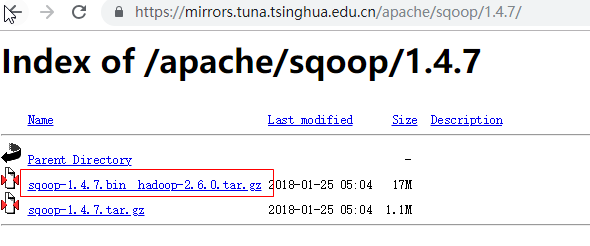
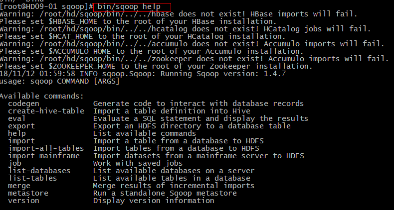
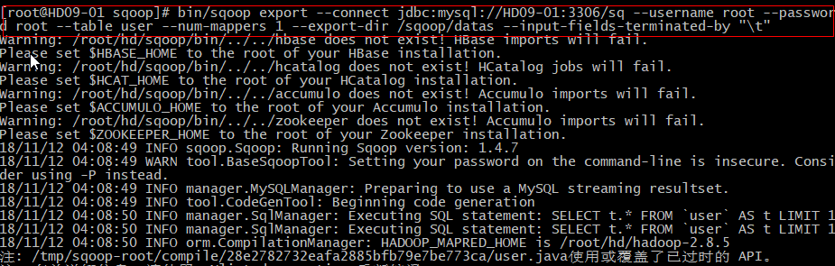
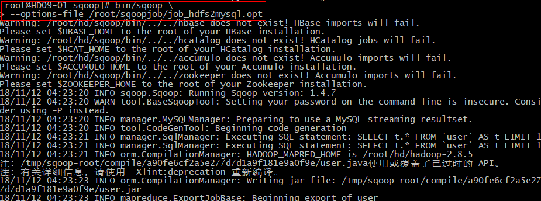
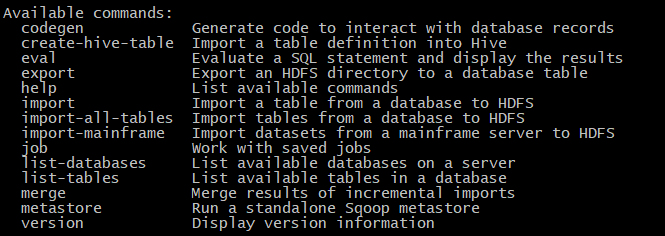

### 概述
+ 简介： Apache Sqoop（TM）是一种用于在Apache Hadoop和结构化数据存储（如关系数据库）之间高效传输批量数据的工具 。      
+ 官网：http://sqoop.apache.org/         
+ 适用场景：传统型数据库数据过大，运行遇到瓶颈，需要迁移到分布式存储
### 安装部署
1. 下载、上传、解压：https://mirrors.tuna.tsinghua.edu.cn/apache/sqoop/1.4.7/        

2. 修改启动配置脚本：mv sqoop-env-template.sh sqoop-env.sh
3. 配置启动脚本 vi sqoop-env.sh
\#Set path to where bin/hadoop is available  
export HADOOP_COMMON_HOME=/root/hd/hadoop-2.8.4     
\#Set path to where hadoop-*-core.jar is available      
export HADOOP_MAPRED_HOME=/root/hd/hadoop-2.8.4     
\#set the path to where bin/hbase is available      
\#export HBASE_HOME=        
\#Set the path to where bin/hive is available       
export HIVE_HOME=/root/hd/hive      
\#Set the path for where zookeper config dir is     
export ZOOCFGDIR=/root/hd/zookeeper-3.4.12/conf
4. 配置Mysql驱动
    1. 下载：wget http://dev.mysql.com/get/Downloads/Connector-J/mysql-connector-java-5.1.39.tar.gz
    2. 解压：tar -zxvf mysql-connector-java-5.1.39.tar.gz
    3. 拷贝：cp mysql-connector-java-5.1.39-bin.jar /root/hd/sqoop/lib/
5. 测试是否成功：bin/sqoop help        

### Import命令
+ 需求：从Mysql导入到HDFS中，全部导入
+ 命令
```
bin/sqoop import \                                            #使用sqoop导入
> --connect jdbc:mysql://HD09-01:3306/sq \ #连接mysql和使用的数据库
> --username root \                                          #mysql账号
> --password root \                                          #mysql密码
> --table user \                                                  #从mysql哪个表导入
> --target-dir /sqoop/datas \                          #存放到hdfs目录
> --delete-taget-dir \                                       #若HDFS存在目标文件，则删除重新创建
> --num-mappers 1 \                                       #指定mappers个数，无需reduce
> --fields-terminated-by "\t"                          #指定切分符
```
> - 注意：若失败，加mysql权限     
grant all privileges on *.* to root@'%' identified by "password";       
flush privileges;
+ 需求：从Mysql导入指定数据到HDFS中
+ 命令：
```
bin/sqoop import \
> --connect jdbc:mysql://HD09-01:3306/sq \
> --username root \
> --password root \
> --target-dir /sqoop/select \
> --delete-target-dir \
> --num-mappers 1 \
> --fields-terminated-by "\t" \
> --query 'select * from user where id=1 and $CONDITIONS#运行Mysql语句进行计算
```
+ 需求：从Mysql导入到Hive
+ 命令：
```
bin/sqoop import \
> --connect jdbc:mysql://HD09-01:3306/sq \
> --username root \
> --password root \
> --table user \ 
> --num-mappers 1 \
> --hive-import \
> --fields-terminated-by "\t" \
> --hive-voerwrite \
> --hive-table user_sqoop
```
> -  hive依赖问题   
vi ~/.bash_profile      
export HADOOP_CLASSPATH=$HADOOP_CLASSPATH:/root/hd/hive/lib/*
### Export命令
+ 需求： 从Hive/HDFS 导出到Mysql
+ 前提：根据Hive的情况创建Mysql的表格(必须先有表格才能导出)
+ 命令：
```
bin/sqoop export 
> --connect jdbc:mysql://HD09-01:3306/sq     #连接Mysql
> --username root                                               #mysql账号
> --password root                                               #mysql密码
> --table user --num-mappers 1                       #mapper个数，可以设置多个，并行处理
> --export-dir /sqoop/datas                             #导出hive/HDFS目录
> --input-fields-terminated-by "\t"                 #hive/HDFS是通过\t切分的
```

+ Mysql中查看数据        

### 打包脚本使用
+ 规范：一行参数，一行值
+ 例子：job_hdfs2mysql.opt
```
export
--connect
jdbc:mysql://HD09-01:3306/sq
--username
root
--password
root
--table
user
--num-mappers
1
--export-dir
/sqoop/datas
--input-filelds-terminated-by
"\t"
```
+ 启动脚本 bin\sqoop --options-file /root/sqoopjob/job_hdfs2mysql.opt       

### 常用命令
|命令|说明|
|---|---|
|import|将数据导入到HDFS/HIVE等|
|export|将集群数据导出到传统数据库或文件|
|codegen|把某张数据库中的表生成javaBean对象并打包|
|eval|查看sql执行结果|
|create-hive-table|创建一个hive表|
|import-all-tables|导入某个数据中所有的表到HDFS/HIVE|
|list-tables|列出某个数据库下的所有表|
|merge|将HDFS/HIVE中不同目录下的数据合并到一起|
|version|查看sqoop的版本|
|help|查看帮助信息|

### 常用参数
|参数|说明|例子|
|---|---|---|
|--connect|连接关系型数据库|bin/sqoop import --connect  jdbc:mysql://HD09-01:3306/sq|
|--connection-manager|指定连接管理类|-|
|--driver|JDBC的driver class|-|
|--username|连接数据库的用户名|bin/sqoop import --username root|
|--password|连接数据库的密码|bin/sqoop import --password root|
|--verbose|在控制台打印详细信息|-|
|--help|查看某个命令的帮助信息|bin/sqoop import --help|
|--hive-import|将关系型数据库导入到hive|-|
|--hive-overwrite|覆盖掉hive表中已存在的数据|-|
|--create-hive-table|创建hive表|-|
|--hive-table|接入hive表|-|
|--table|指定关系新数据库表|-|
