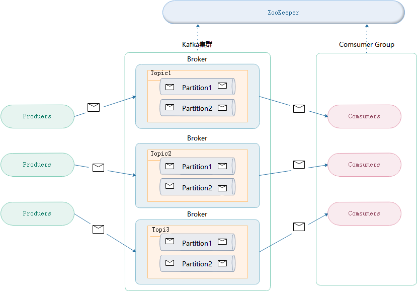
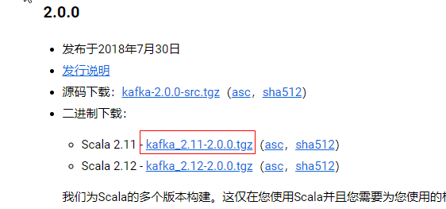
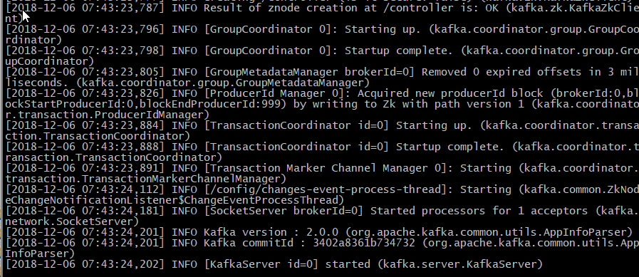
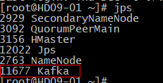
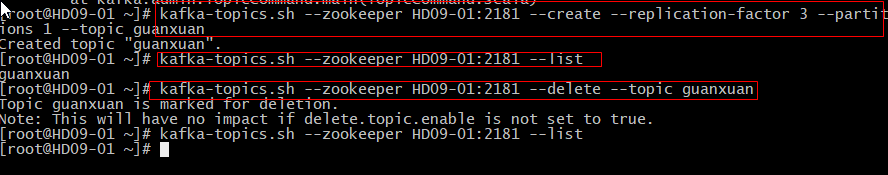
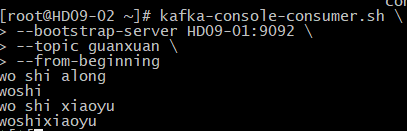
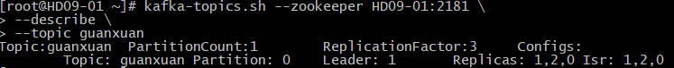

### 概述
+ 官网：http://kafka.apache.org/
+ 简介：
1. 在流计算中，Kafka主要功能是用来缓存数据，storm、Flink、Spark等可以通过消费kafaka中的数据进行计算
2. 是一套开源的消息系统，由scala开发，支持javaApi的。
3. Kafaka最初是由LinkedIn公司开发，2011年开始开源；2012年从Apache毕业。
4. 是一个分布式消息队列，Kafka读消息保存采用Topic进行归类的
+ 关键功能
1. 发布和订阅记录流，类似于消息队列或企业消息传递系统。
2. 以容错的持久方式存储记录流。
3. 记录发生时处理流。
+ 使用场景
1. 构建可在系统或应用程序之间可靠获取数据的实时流数据管道
2. 构建转换或响应数据流的实时流应用程序
+ 角色
1. 发送消息：Producer(生产者)
2. 接收消息：Consumer(消费者)
### 为什么要使用消息队列？
1. 解耦：为了避免出现问题
2. 拓展性：可增加处理过程
3. 灵活：面对访问量剧增，不会因为超负荷请求而完全瘫痪。
4. 可恢复：一部分组件失效，不会影响整个系统，可以进行恢复。
5. 缓冲：控制数据流经过系统的速度
6. 顺序保证：对消息进行有序处理
7. 异步通信：消息队列提供了异步处理的机制，允许用户把消息放到队列，不立即处理。
### 架构
+  kafka依赖zookeeper，用来保存元数据信息
+ zookeeper在kafka用途
1. 保存kafka集群节点的状态信息
2. 保存消费者当前消费信息      

### 集群安装部署
1. 下载：https://kafka.apache.org/downloads        

1. 上传、解压  tar -zxvf *.tgz -C hd/
2. [可选]重命名：mv kafka_2.11-2.00 kafka
3. 修改配置文件：vi config/server.properties       
`broker.id = 0   每个broker需要不一样`       
`delete.topic.enbale=true 是否允许删除topic`        
`log.dirs=/root/hd/kafka/logs   存放日志路径`       
`zookeeper.connect=Hadoop01:2181,Hadoop02:2181,Hadoop03:2181   Zookpeer集群配置`
4. 配置环境变量：      
`export KAFKA_HOME=/root/hd/kafka `       
`export PATH=$PATH:$KAFKA_HOME/bin `      
注:source /etc/profile 才会生效
5. 集群间拷贝：       
scp -r kafka/ HD09-02:$PWD      
cd /etc/profile     
scp profile HD09-02:$PWD    
6. 修改broker.id      
broker.id=1     
broker.id=2
7. 启动服务
    1. 先启动zookeeper:zkServer.sh start(所有集群都需要执行)
    2. 进入kafka的bin目录：cd /root/hd/kafka/bin 
    3. 后台启动：/root/hd/kafka/bin/kafka-server-start.sh /root/hd/kafka/config/server.properties &      
          
    4. 进程查看：jps     
    
### 常用命令
+ 查看当前集群中已存在的主题：kafka-topics.sh --zookeeper HD09-01(主机名):2181 --list
+ 创建topic
```
kafka-topics.sh --zookeeper HD09-01:2181 --create --replication-factor 3 --partitions 1 --topic guanxuan
--zookeeper 连接zk集群
--create 创建
--replication-factor 副本数
--partitions 分区
--topic 主题名
```
+ 删除topic：kafka-topics.sh --zookeeper HD09-01(主机名):2181 --delete --topic guanxuan(topic名称)      

+ 发送消息
    + 启动生产者：
    ```
    kafka-console-producer.sh \
    > --broker-list HD09-01:9092 \      #指定broker的设备和端口
    > --topic guanxuan \                      #指定发送的主题
    ```
    + 启动消费者：
    ```
    kafka-console-consumer.sh \
    > --bootstrap-server HD09-01:9092 \  #指定生产者设备和端口
    > --topic guanxuan \   #指定topic
    > --from-beginning     #开始消费消息
    ```
    
+ 查看主题信息
```
kafka-topics.sh --zookeeper HD09-01:2181 \
 --describe \           #描述
 --topic guanxuan
```

### 常用API


