### 简介
+ 官网：https://www.scala-lang.org/
+ 特点：Scala语言很强大，集成了面向对象和函数式的编程特点。
+ 大数据中为什么学习Scala？
    1. Spark是Scala语言编写。
	2. Python写Spark  挺好的
	3. Java写Spark  很糟糕（代码过多）
	4. Scala写Spark 完美
### 特点
##### 优雅
+ 框架设计中第一个要考虑的问题就是API是否优雅，是否精简封装、代码精简(少)
##### 速度快
+ Scala语言表达能力强，一行代码=多行Java代码，开发速度快
##### 完美的融合Hadoop生态
+ Scala是静态编译，表达能力强并且代码量少
### 安装部署
+ 安装教程：http://www.runoob.com/scala/scala-install.html
+ 下载安装包(Windos为例)：https://www.scala-lang.org/download/      
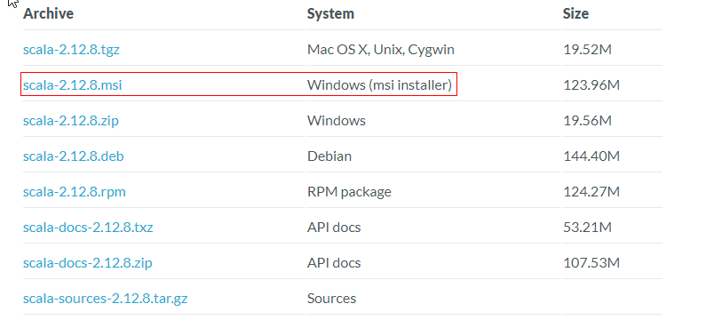
+ 点击下一步下一步安装即可
+ 配置环境变量：
    + 设置 SCALA_HOME 变量：单击新建，在变量名栏输入：SCALA_HOME: 变量值一栏输入：D:\Program Files（x86）\scala 
也就是 Scala 的安装目录，根据个人情况有所不同，如果安装在 C 盘，将 D 改成 C 即可。 
    > - 注：安装目录不能包含空格，会报错        

    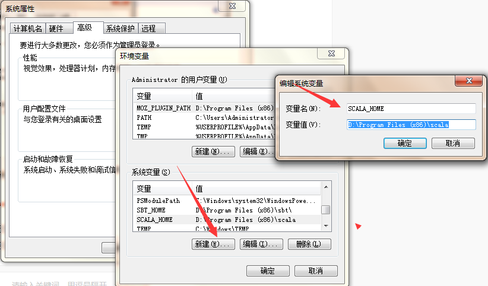
    + 设置 Path 变量：找到系统变量下的"Path"如图，单击编辑。在"变量值"一栏的最前面添加如下的路径：%SCALA_HOME%\bin;
    > - 注意：后面的分号 ； 不要漏掉。
    
    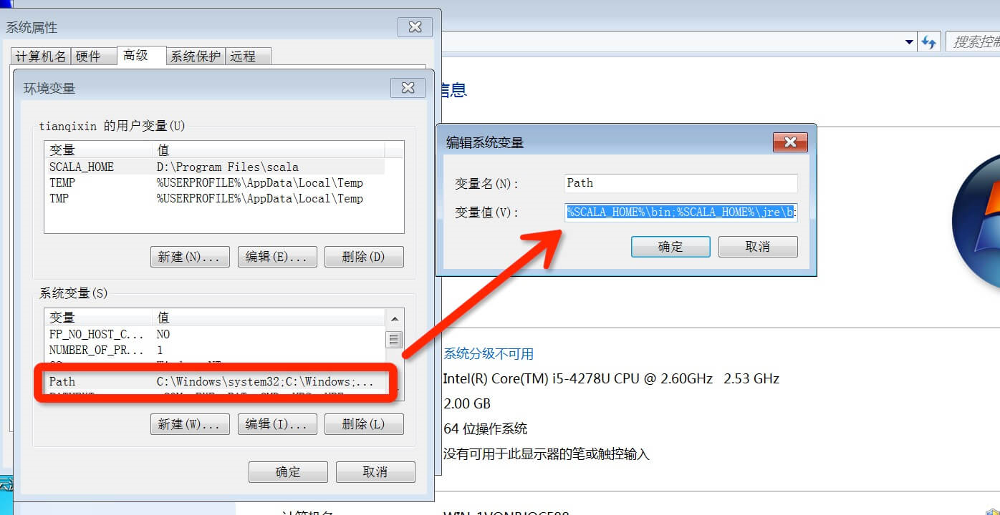
+ 测试：检查环境变量是否设置好了：调出"cmd"检查。单击 【开始】，在输入框中输入cmd，然后"回车"，输入 scala，然后回车，
如环境变量设置ok，你应该能看到这些信息。       
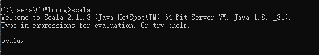
### 基础语法
1. HelloScala.scala
    1. 编码
    ```
    object HelloScala{
        def main(args:Array[]){
            println("HelloScala")
        }
    }
    ```
    2. 编译：scalac HelloScala.scala
    3. 执行：scala HelloScala
2. 数据类型

   |数据类型|描述|
   |---|---|
   |Byte|8位有符号的补码整数。数值区间-128到127|
   |Short|16位有符号的补码整数。数值区间为-32768到32767|
   |Int|32位有符号的补码整数。数值区间为-2147483648到2147483647|
   |Long|64位有符号补码整数。数值区间为-9223372036854775808到9223372036854775807|
   |Float|32位。IEEE754标准的单精度浮点数|
   |Double|64位IEEE754标准的双精度浮点数|
   |Char|16位无符号Unicode字符|
   |String|字符序列|
   |Unit|表示无值，和其他语言的中的void等同。用做不返回结果的方法的结果类型。Unit只有一个实例值，写成()|
   |Null|null或空引用|
   |Noting|Noting类型在Scala的类层级的最低端，他是任何其他类型的子类型|
   |Any|Any是所有其他类的超类|
   |AnyRef|AnyRef类是Scala里所有引用类的基类|
   
   > - Scala无包装类型
3. 定义变量
    + var：修饰的变量是可变的
    + val: 修饰的变量是不可变的   
4. Scala编译器自动判断类型
    + 标准写法：val str:String="along"(注:指定了类型需要后面的值和类型保持一致)
5. 条件表达式：if     
if(x>0) 1 else 2        
if(x>0) "along" else 2
6. 块表达式：使用{}包括的一系列表达式，块中最后一个表达式的值就是块的值
7. 循环:for       
    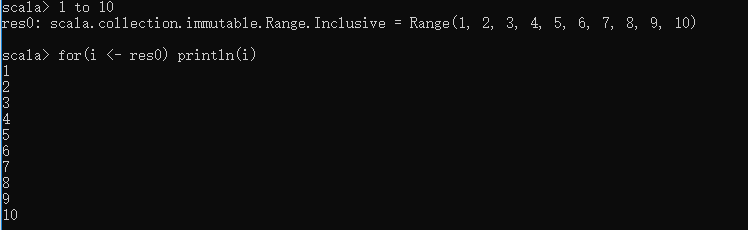       
    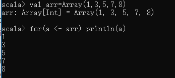       
    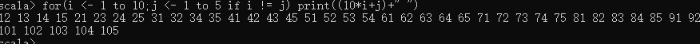       
    + <-:表示接收值      
    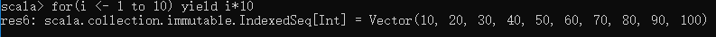
    + yield:表示生成一个新的集合关键字       
    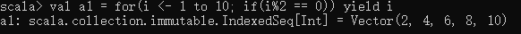
    + _:表示前面的元素，为元祖     
    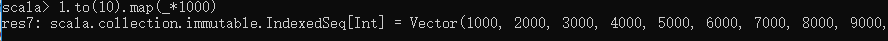
8. 方法定义
    + **Scala中 + - *  / %的作用和Java一样，但是特别的是，这些操作符实际上是方法**        
    
    + 定义：       
    def m1(a:Int,b:Int):Int{        
        a + b       
    }
        + def : 定义方法的关键字
        + m1：方法名
        + a、b：参数
        + Int：返回值类型
        + a+b：函数体       
    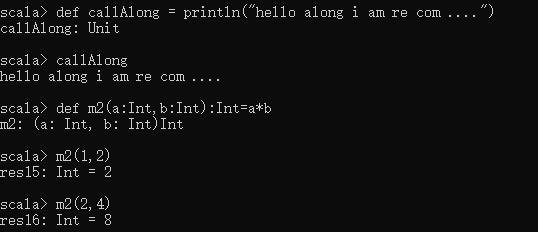
    ```
    object ScalaFun {
    def main(args: Array[String]): Unit = {
        println(m1(2,3))
        println(m2(2,3))
        }
    
    def m1(a: Int, b: Int): Int = {
        a + b
        }
    
    def m2(a: Int, b: Int): Int = {
        a * b
        }
    }
    ```
### 函数
+ 方式1：将方法转换为函数      
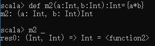
> - (Int,Int) ： 参数列表
> -  Int：返回值类型
> -  \<function2\> ：表示是函数,2表示有两个参数
> -   =>： 该符号表示一个函数
+ 方式2：直接定义      
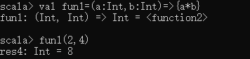
>  fun1： 函数名        
(a:Int,b:Int): 函数的参数列表      
{a*b}：函数体
+ 函数VS方法：Scala有方法和函数，二者在语义上的区别很小
    1. 方法是类的一部分
	2. 函数是一个对象可以赋值给一个变量，是一个完整的对象，其实是继承Trait的类的对象
	3. 在类定义中的方法既是函数
	4. 使用val 定义函数，def定义方法
### 传值调用&传名调用
> - 使用IDE为IDEA，需要安装Scala(点击File->Settings->Plugins)输入Scala安装
> - 创建Scala工程优点NEW->Models->Scala       
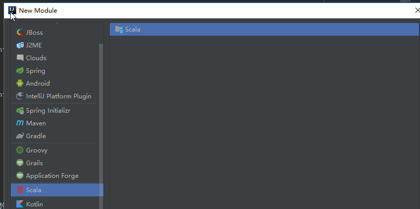
+ 函数式编程：方法的参数可以是一个函数
+ 传值调用(call-by-value)：先计算参数表达式的值，再运用到函数的内部
```
    object toPay {
        var money = 1000
    
        // 吃饭一次花50
        def eat(): Unit = {
            money -= 50
            println("吃了一次饭")
        }
    
        // 余额
        def banlace(): Int = {
            eat()
            money
        }
    
        // 打印
        def printMony(x:Int): Unit = {
            for (a <- 1 to 5) {
                println(s"你的余额:$x")
            }
        }
    
        def main(args: Array[String]): Unit = {
            printMony(banlace())
        }
    }
```
+ 传名调用(call-by-name)：将未计算的参数表达式直接应用到函数内部
```
    object toPay {
        var money = 1000
    
        // 吃饭一次花50
        def eat(): Unit = {
            money -= 50
            println("吃了一次饭")
        }
    
        // 余额
        def banlace(): Int = {
            eat()
            money
        }
    
        // 打印
        def printMony(x: => Int): Unit = {
            for (a <- 1 to 5) {
                println(s"你的余额:$x")
            }
        }
    
        def main(args: Array[String]): Unit = {
            printMony(banlace())
        }
    }
```
> - 代码不同点在于printMoney，      
传值为x:Int(需要等待balance运行完后)，      
而传名为x:=>Int(表示传入一个函数，传入后才会运行)
### 可变参数
+ Java中可变参数为...
+ Scala允许指明函数**最后一个参数**是可以重复的，即我们不需要指定函数的参数个数，可以向函数传入任意数量的参数
+ Scala通过在参数的类型后面加*来设置可变参数，例如:**def sum(a: Int*)**
```
object ManyParm {
    def sum(a: Int*): Int = {
        var sum = 0
        for (v <- a) {
            sum += v
        }
        sum
    }  
    //Any*可以传入任意的类型
    def setName(args:Any*):Unit={
        for(arg <- args){
        println(arg)
        }
    }
    def main(args: Array[String]): Unit = {
        println(sum(1,2,3,4))
        println(sum(1,2,3,4,5,6))
        setName("along","aera",1,2)
        setName("123",1)
    }
}
```
### 默认参数函数
> - Scala 可以为函数参数指定默认参数值，使用了默认参数，你在调用函数的过程中可以不需要传递参数，这时函数就会调用它的
默认参数值，如果传递了参数，则传递值会取代默认值
```
object Test {
    def main(args: Array[String]) {
        println( "返回值 : " + addInt() );
    }
    def addInt( a:Int=5, b:Int=7 ) : Int = {
        var sum:Int = 0
        um = a + b
         sum
    }
}
```
### 高阶函数
> - Scala 中允许使用高阶函数, **高阶函数可以使用其他函数作为参数，或者使用函数作为输出结果。**
> -  高阶函数（Higher-Order Function）就是操作其他函数的函数。
```
object HighFun {
    //高阶函数可以使用其他函数作为参数，或者使用函数作为输出结果
    def getPerson(h: Int => Unit, f: Int): Unit = {
        //调用函数h，它的参数是f
        h(f)
    }

    def person(x: Int): Unit = {
        println(s"我的年龄是$x")
    }

    def main(args: Array[String]): Unit = {
        getPerson(person,18)
    }
}
```
### 部分应用函数
> - 如果函数传递所有的预期函数，则表示完全应用函数
> - 如果只传递了几个参数，并不是全部参数，name将返回部分应用的函数
> - 先不传入的函参数，可以使用 _:[参数类型]  代替
```
object Test {
    def main(args: Array[String]) {
        val date = new Date
        //返回的也是一个函数
        val logWithDateBound = log(date, _ : String)

        logWithDateBound("message1" )
        Thread.sleep(1000)
        logWithDateBound("message2" )
        Thread.sleep(1000)
        logWithDateBound("message3" )
    }

    def log(date: Date, message: String) = {
        println(date + "----" + message)
    }
}
```
+ Result        
Tue Dec 18 11:25:54 CST 2018----message1        
Tue Dec 18 11:25:54 CST 2018----message2        
Tue Dec 18 11:25:54 CST 2018----message3        
### 柯理化(Currying）
> -  柯里化(Currying)指的是将原来**接受多个参数的函数变成新的接受一个参数的函数的过程**。新的函数返回一个以原有第二个参数为参数的函数。
> - 作用：函数的通用性降低，但是实用性提高     
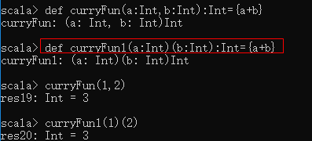
### 插值器
+ s插值器：可以处理**任意的表达式和接收任意类型的变量**     
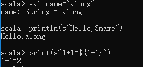
+ f插值器： 所有的变量引用可以跟一个printf-style格式的字符串，如%d
> - 当指定了格式后，变量或者表达式返回值必须是对应的类型

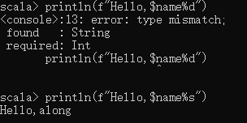
+ raw插值器：主要针对需要**输出特殊符号的时候，不进行转义即可输出**，例如\n     

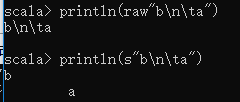
### 偏函数
+ 被包含{}内没有match的一组case语句的是一个偏函数
> - PartialFun[A,B]     
    A:参数类型      
    B:返回值类型     
```
object PartialFun {
    //定义普通函数
    def func(str: String): Int = {
        if (str.equals("along")) 18 else 0
    }

    // 定义偏函数
    def parFun: PartialFunction[String, Int] = {
        //如果使用了偏函数，我们必须用case
        case "along" => 18
        case _ => 0
    }

    def main(args: Array[String]): Unit = {
        println(func("along"))
        println(parFun("Along"))
    }
}
```
